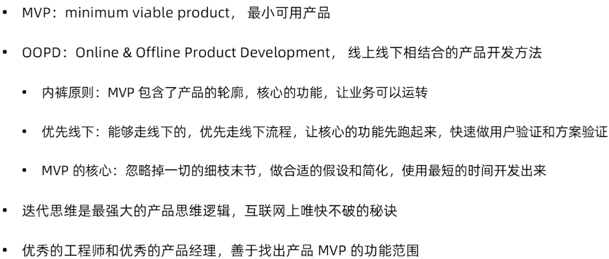
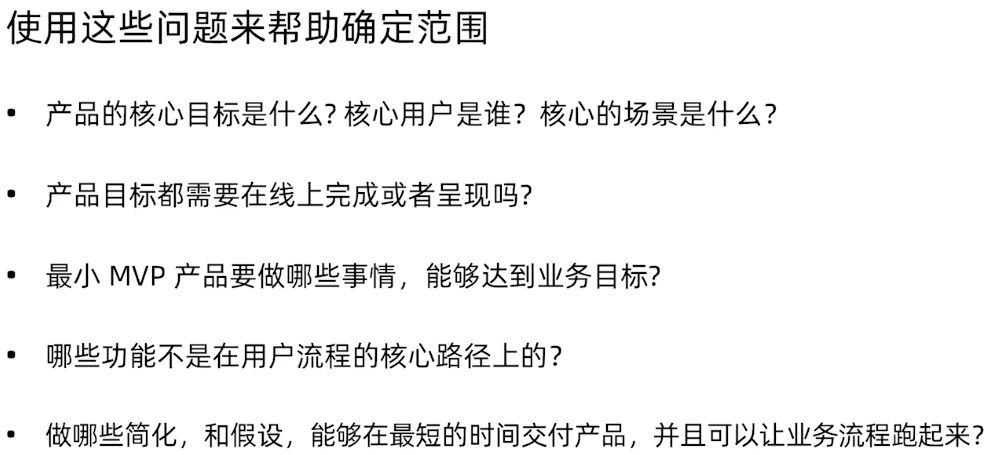
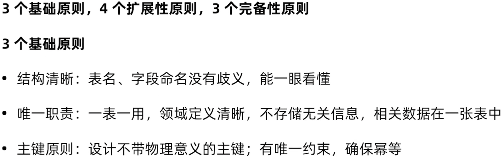
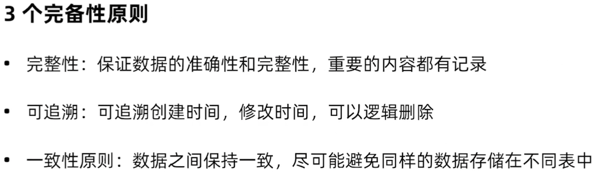

# ENV
- Python 3.9.1
- django 4.0.1
- PyCharm 2021.3.1

# Running
```bash
# project
$ cd recruitment

# install
$ pip3 install -r requirements.txt

# running
$ python manage.py runserver 0.0.0.0:8000
```

# 指定环境配置文件
```bash
$ python manage.py runserver 0.0.0.0:8000 --settings=settings.local
```

# 登录信息
> user:admin  
> password:123456

# 支持 LDAP 账号登录
[OpenLDAP 安装配置](docs/openldap.md)

# 支持钉钉发送通知
[钉钉安装配置](docs/dingtalk.md)

# 支持多语言
[多语言配置](docs/multi_language.md)

# 集成 Sentry 实时事件日志和聚合平台
[Sentry 日志平台](docs/sentry.md)

# REST Framework 开放 API
[Django REST Framework](docs/rest_framework.md)

# 使用 Redis 缓存
[Django Redis](docs/redis.md)

# 集成 Celery 分布式任务队列
[Celery 分布式任务队列](docs/celery.md)

# 多数据库路由
[多数据库路由](docs/multi_db_routers.md)

# Django 之美：常用插件
[Django 常用插件](docs/the_beauty_of_django.md)

# 单元测试
[单元测试](docs/testcase.md)

# MVP
## 迭代思维与 MVP 产品规划方法（OOPD）


## 如何找出产品的 MVP 功能范围？


## 企业级数据库设计十个原则
### 基础原则


### 扩展性原则


### 完备性原则

