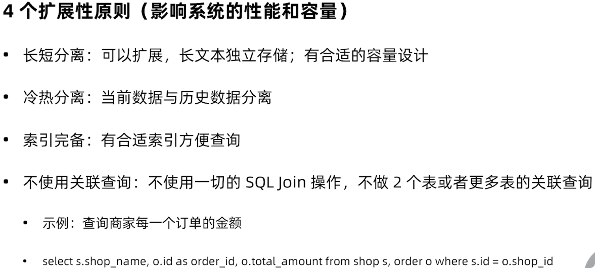

# ENV
- Python 3.9.1
- django 4.0.1
- PyCharm 2021.3.1

# Running
```bash
# project
$ cd recruitment

# install
$ pip3 install -r requirements.txt

# running
$ python manage.py runserver 0.0.0.0:8000
```

# 指定环境配置文件
```bash
$ python manage.py runserver 0.0.0.0:8000 --settings=settings.local
```

# 登录信息
> user:admin  
> password:123456

# 支持 LDAP 账号登录
[OpenLDAP 安装配置](docs/openldap.md)

# 支持钉钉发送通知
[钉钉安装配置](docs/dingtalk.md)

# 支持多语言
[多语言配置](docs/multi_language.md)

# 集成 Sentry 实时事件日志和聚合平台
[Sentry 日志平台](docs/sentry.md)

# REST Framework 开放 API
[Django REST Framework](docs/rest_framework.md)

# 使用 Redis 缓存
[Django Redis](docs/redis.md)

# 集成 Celery 分布式任务队列
[Celery 分布式任务队列](docs/celery.md)

# 多数据库路由
[多数据库路由](docs/multi_db_routers.md)

# Django 之美：常用插件
[Django 常用插件](docs/the_beauty_of_django.md)

# 单元测试
[单元测试](docs/testcase.md)

# 生产环境部署准备
[生产环境准备](docs/production_deploy.md)

# 监控告警
[Prometheus&Grafana](docs/prometheus_grafana.md)

# 生产环境中的安全
[生产环境中的安全](docs/safety_in_production.md)

# 容器化部署
[容器化部署](docs/container_deployment.md)

# MVP
## 迭代思维与 MVP 产品规划方法（OOPD）


## 如何找出产品的 MVP 功能范围？


## 企业级数据库设计十个原则
### 基础原则


### 扩展性原则


### 完备性原则


# 快速迭代的价值与挑战
## 快速迭代
以天，甚至小时为单位，持续完善产品，交付到用户的循环过程。

## 快速迭代的价值
- 时间是最大的成本，机会瞬息即逝，赢得市场先机；
- 快速验证需求，减少不对用户产生价值的投入（Fail fast, fail better）；
- 快速验证方案，提高研发效率；
- 加速反馈，给到团队和自己即时的激励。

## 加速迭代的挑战
- 产品设计者：能梳理清楚业务流程，抓住客户的重点需求，能把客户需求转化为系统需求；
- 开发者：充分理解用户需求，有足够的能力，能用简洁的方案来设计出易维护的系统。

## 根本挑战
- 市场、用户、技术、环境变化太快，产品开发赶不上节奏；
- 几乎不能从一开始就设计出一个完美的，能够适应未来长时间变化的方案；
- 几乎没人愿意承认，自己没有足够的能力（或条件）设计出一个完美的产品（系统）。

# 使用 OOPD 方法识别产品核心功能
## OOPD 产品开发流程
OOPD，Online and Offline integrated Product Development.  


## 快速迭代的原则
- 自助原则
  - 做自己用的产品，自己用自己的产品，吃自己的狗食；
- 0 day 原则
  - 找到明确的核心问题，拆解目标，抓住核心的问题，忽略掉一切细节，0 day 发布；
- 时限原则
  - 设定时限，挑战自我，不给自己写 Bug 的时间；
- 不完美原则
  - 不做完美的产品（没有完美的产品，不去为了完美而浪费宝贵的资源）
- 谦卑原则
  - 能够看到自己的局限性，获取用户反馈，持续迭代，听取用户声音。

# 如何做好技术方案设计与工作拆解
## 做技术方案设计的前提条件
- 有明确的用户场景，用户如何跟产品交互，期望拿到什么样的预期结果；
- 有清晰定义的业务流程。

## 技术方案设计流程


## 用什么工具？
- Visual Paradigm
- Lucid Chart
- Visio
- Gliffy
- Draw.io
- Astash
- StarUML
- ...

### 推荐工具
白板/白纸，不用工具是最好的工具。

## 产出的技术方案设计文档要素
- 产品背景（用户场景，产品目标，引用到的业务流程，产品需求文档）；
- 要解决的问题列表，系统不解决的问题列表，系统的限制；
- 对于问题的不同解决方案的对比，阐述各个主要的问题如何被解决；
- 所选整体的流程图（序列图），模块关系图，重要的接口、实体的概念定义；
- 除了功能之外的其它方面的设计，包括安全、性能、可维护性、稳定性、监控、扩展性、易用性等。


## 工作拆解
任何事情，只要氢它拆解到足够细，你都能够完成它。

## 工作拆解原则
- 优先级
  - 主流程上，不确定的工作优先完成（建议提前一个迭代做调研）；
- 核心流程优先
  - 核心工作优先，先把主流程跑通；
- 依赖
  - 减少不同人之间的工作依赖，并保持团队工作拆解的透明，预留 20% Buffer；
- 拆解粒度
  - 拆解到每项子任务 0.5-1 天的粒度，最长不超过 2 天。

# 如何保证交付质量和持续迭代
- 定义好清晰产品需求，产品需求从根本上决定了软件的质量；
- 系统有整体上的架构方案的设计、评估、评审；系统设计决定了软件实现的质量；
- 工程的角度持续交付的最佳实践推荐：
  - `Code Review`：生一次提交都有 `CR`，每次 `commit` 代码量 < 200 行，频繁 `commit`；
  - 单元测试：项目开始建立好单元测试的机制，在持续集成中自动运行；
  - 自动化回归：对预发/线上系统做 API/页面自动化测试（Postman/Robot Framework）；
  - 使用 `CI/CD` 机制对系统进行自动化打包、测试、部署、线上验证。
- 发布过程做到可监控、可回滚；
- 对于大量用户使用的产品，使用灰度机制；
- 架构上对于意外的并发访问进行限流、降级；
- 架构上使用配置开关，对系统功能提供实时的开启/关闭的服务；
- 对产品建立 `A/B Test` 机制，通过数据来快速对比不同版本，不同方案的效果；
- 自动化所有的事情，代码化所有过程：代码化配置、代码化部署流程、代码化基础设施；
  - 声明式 `API`、`CI/CD Pipeline`、`K8S`、`Helm`、`Terraform`.
