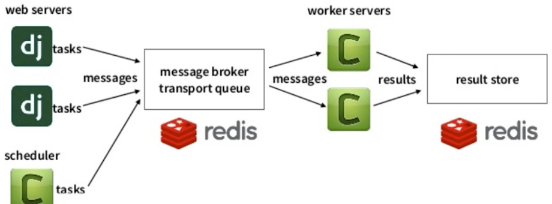
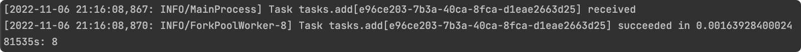
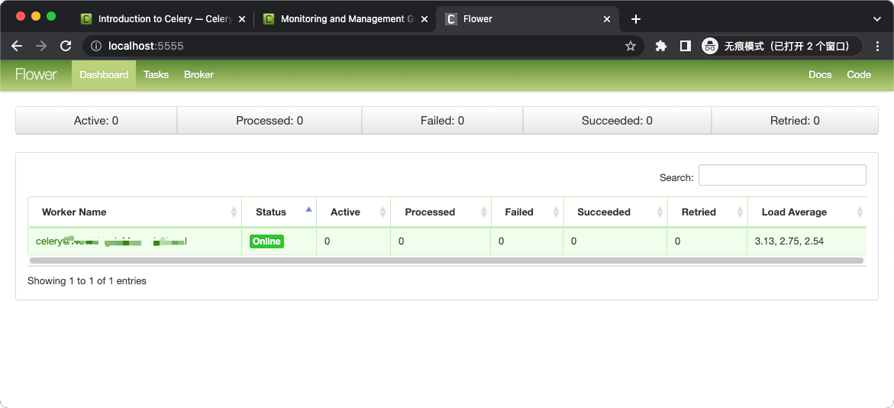
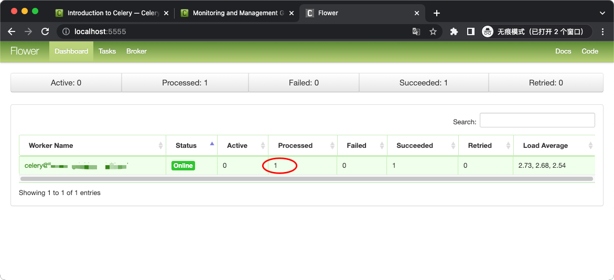
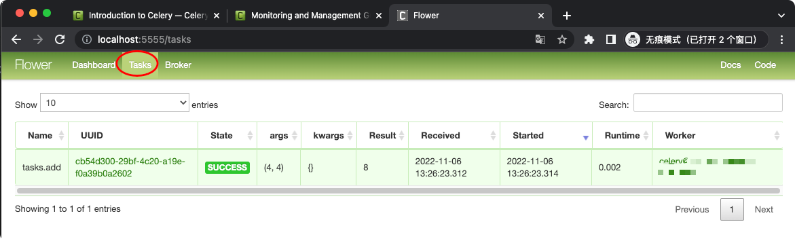
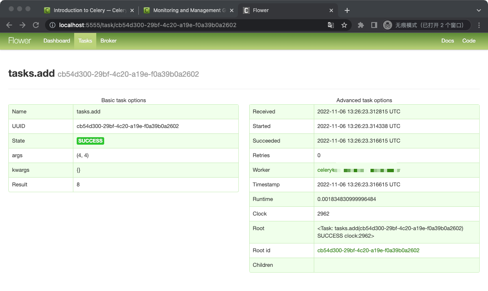
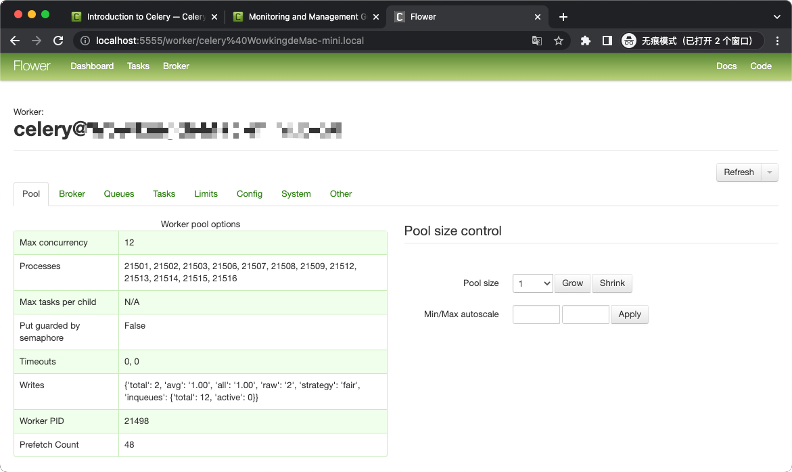

# Celery 分布式任务队列


## 安装
```shell
$ pip install -U Celery

# 安装依赖包，选择 Redis 作为消息队列
$ pip install "celery[redis,auth,msgpack]"
```

## 任务脚本
### 异常任务
[celery/tasks.py](../celery/tasks.py)

### 运行任务
[celery/run_task.py](../celery/run_task.py)


## 运行
## 运行 Celery worker
```shell
$ cd celery 

# -A：app
$ celery -A tasks worker --loglevel=info 
 
 -------------- celery@Wowking v5.2.7 (dawn-chorus)
--- ***** ----- 
-- ******* ---- macOS-13.0-x86_64-i386-64bit 2022-11-06 20:37:50
- *** --- * --- 
- ** ---------- [config]
- ** ---------- .> app:         tasks:0x102682ca0
- ** ---------- .> transport:   redis://127.0.0.1:16379//
- ** ---------- .> results:     redis://127.0.0.1:16379/
- *** --- * --- .> concurrency: 12 (prefork)
-- ******* ---- .> task events: OFF (enable -E to monitor tasks in this worker)
--- ***** ----- 
 -------------- [queues]
                .> celery           exchange=celery(direct) key=celery
                

[tasks]
  . tasks.add

[2022-11-06 20:37:50,415: INFO/MainProcess] Connected to redis://127.0.0.1:16379//
[2022-11-06 20:37:50,418: INFO/MainProcess] mingle: searching for neighbors
[2022-11-06 20:37:51,433: INFO/MainProcess] mingle: all alone
[2022-11-06 20:37:51,453: INFO/MainProcess] celery@Wowking ready.
```

### 运行任务
```shell
$ cd celery
$ python run_task.py
Is task ready: False
task result: 8
```

## 测试
### 查看 worker 日志



# Flower 实时 Celery Web 监控
## 安装启动
```shell
$ pip install flower

# 启动
$ cd celery
$ celery -A tasks flower --broker=redis://127.0.0.1:16379/0
You have incorrectly specified the following celery arguments after flower command: ['--broker']. Please specify them after celery command instead following this template: celery [celery args] flower [flower args].
[I 221106 21:22:56 command:162] Visit me at http://localhost:5555
[I 221106 21:22:56 command:170] Broker: redis://127.0.0.1:16379//
[I 221106 21:22:56 command:171] Registered tasks: 
    ['celery.accumulate',
     'celery.backend_cleanup',
     'celery.chain',
     'celery.chord',
     'celery.chord_unlock',
     'celery.chunks',
     'celery.group',
     'celery.map',
     'celery.starmap',
     'tasks.add']
[W 221106 21:22:56 command:177] Running without authentication
[I 221106 21:22:56 mixins:225] Connected to redis://127.0.0.1:16379//
```

## 浏览器访问
`http://localhost:5555`


## 重新运行任务
### 运行 run_task 脚本
```shell
$ python run_task.py
Is task ready: False
task result: 8
```

### 查看 flower
可看到 Processed 与 Succeeded


tasks


详细信息


Worker

