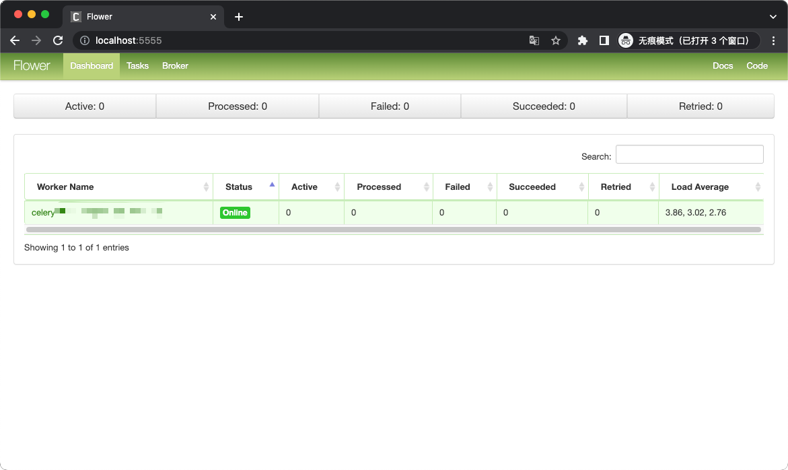
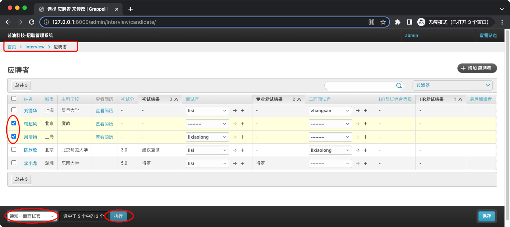
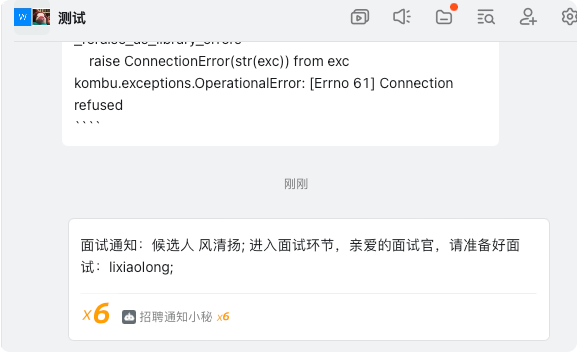
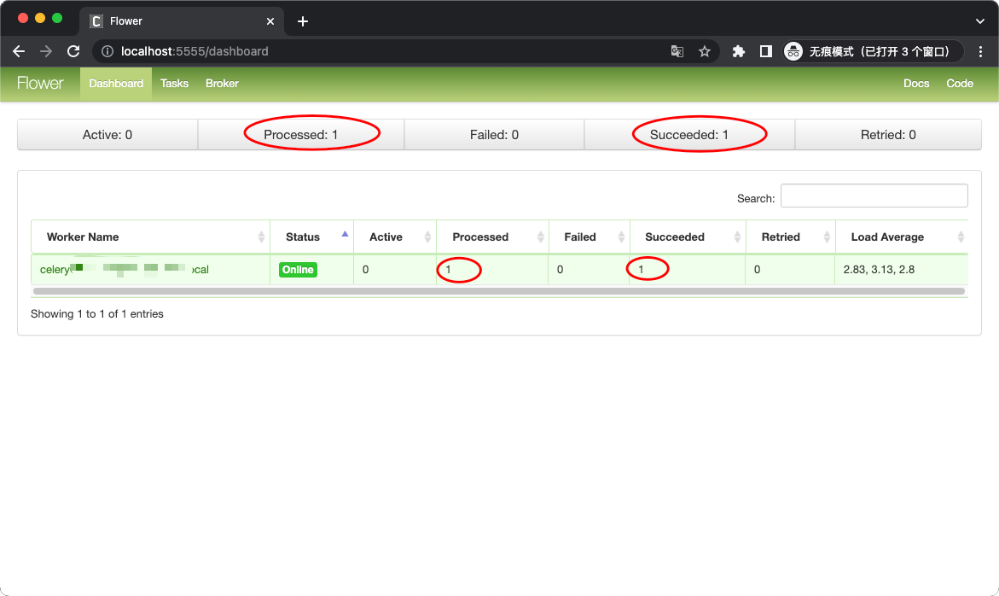
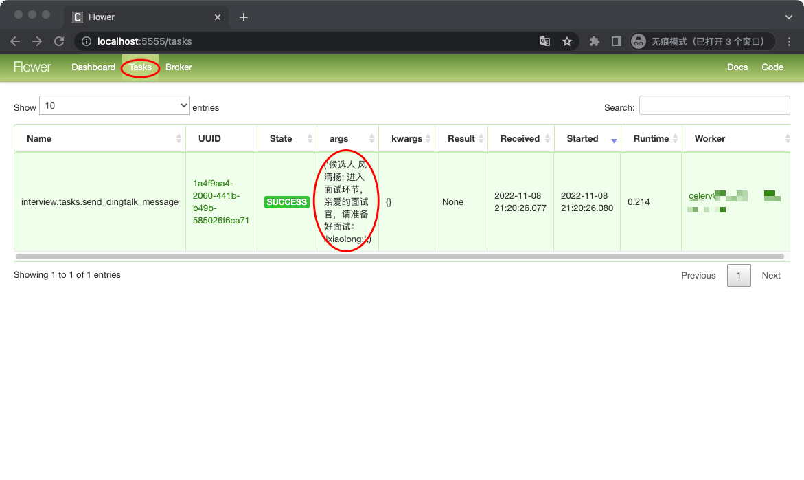
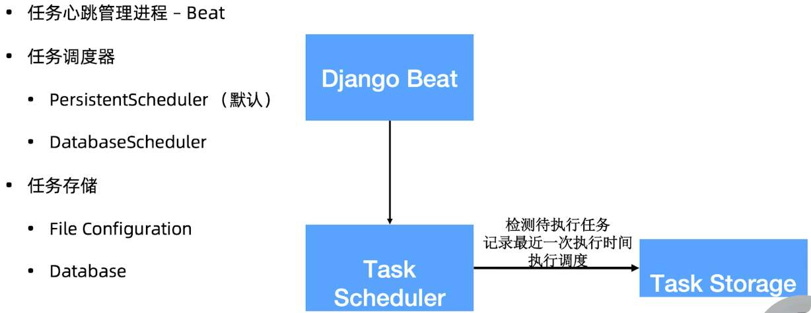
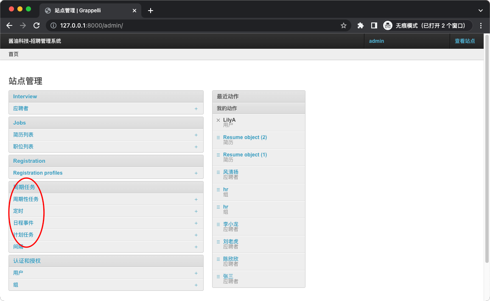
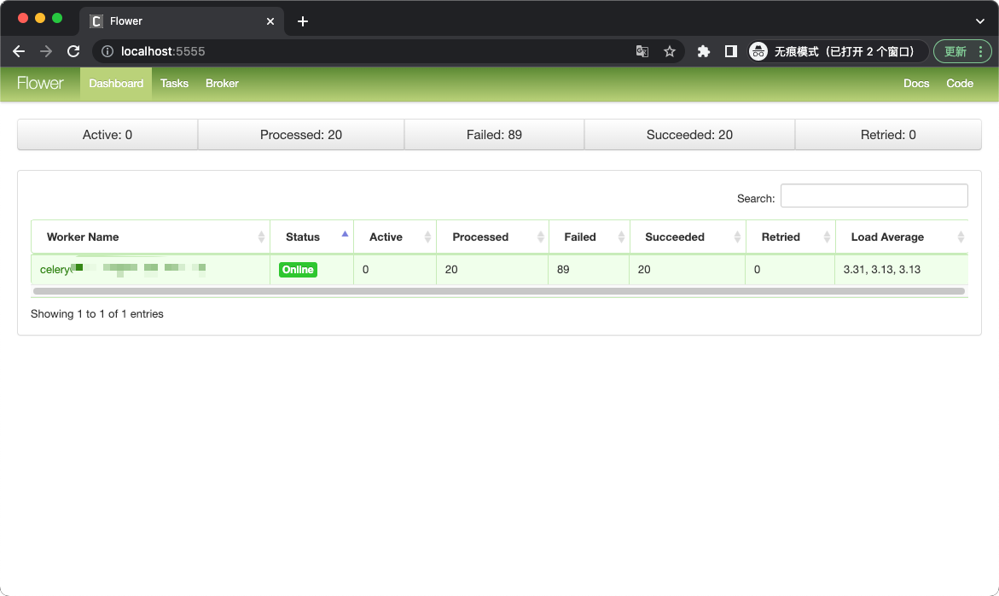
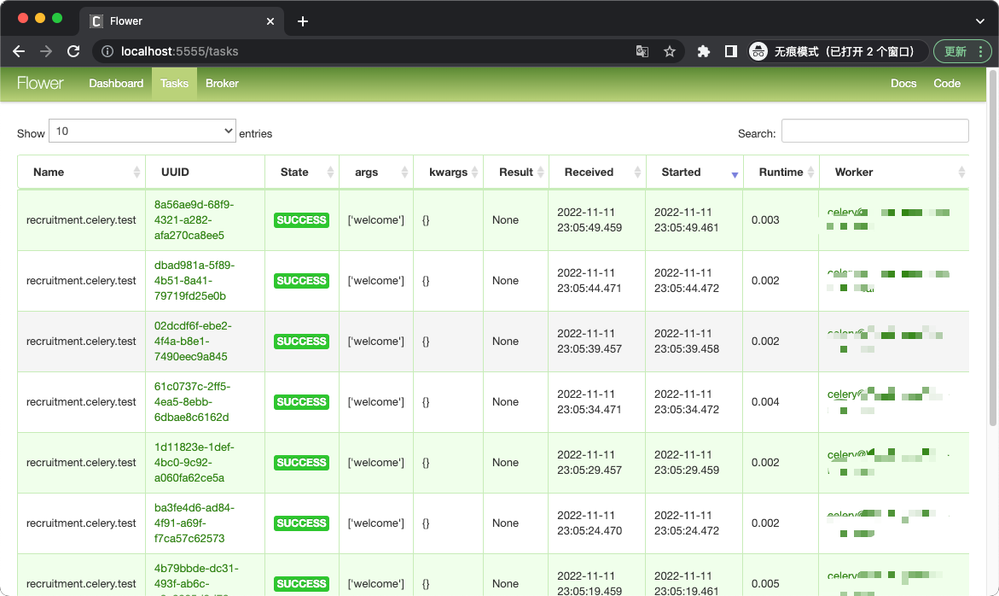

# Celery 分布式任务队列


## 安装
```shell
$ pip install -U Celery

# 安装依赖包，选择 Redis 作为消息队列
$ pip install "celery[redis,auth,msgpack]"
```

## 任务脚本
### 异常任务
[celery/tasks.py](../celery/tasks.py)

### 运行任务
[celery/run_task.py](../celery/run_task.py)


## 运行
## 运行 Celery worker
```shell
$ cd celery 

# -A：app
$ celery -A tasks worker --loglevel=info 
 
 -------------- celery@Wowking v5.2.7 (dawn-chorus)
--- ***** ----- 
-- ******* ---- macOS-13.0-x86_64-i386-64bit 2022-11-06 20:37:50
- *** --- * --- 
- ** ---------- [config]
- ** ---------- .> app:         tasks:0x102682ca0
- ** ---------- .> transport:   redis://127.0.0.1:16379//
- ** ---------- .> results:     redis://127.0.0.1:16379/
- *** --- * --- .> concurrency: 12 (prefork)
-- ******* ---- .> task events: OFF (enable -E to monitor tasks in this worker)
--- ***** ----- 
 -------------- [queues]
                .> celery           exchange=celery(direct) key=celery
                

[tasks]
  . tasks.add

[2022-11-06 20:37:50,415: INFO/MainProcess] Connected to redis://127.0.0.1:16379//
[2022-11-06 20:37:50,418: INFO/MainProcess] mingle: searching for neighbors
[2022-11-06 20:37:51,433: INFO/MainProcess] mingle: all alone
[2022-11-06 20:37:51,453: INFO/MainProcess] celery@Wowking ready.
```

### 运行任务
```shell
$ cd celery
$ python run_task.py
Is task ready: False
task result: 8
```

## 测试
### 查看 worker 日志


# Flower 实时 Celery Web 监控
## 安装启动
```shell
$ pip install flower

# 启动
$ cd celery
$ celery -A tasks flower --broker=redis://127.0.0.1:16379/0
You have incorrectly specified the following celery arguments after flower command: ['--broker']. Please specify them after celery command instead following this template: celery [celery args] flower [flower args].
[I 221106 21:22:56 command:162] Visit me at http://localhost:5555
[I 221106 21:22:56 command:170] Broker: redis://127.0.0.1:16379//
[I 221106 21:22:56 command:171] Registered tasks: 
    ['celery.accumulate',
     'celery.backend_cleanup',
     'celery.chain',
     'celery.chord',
     'celery.chord_unlock',
     'celery.chunks',
     'celery.group',
     'celery.map',
     'celery.starmap',
     'tasks.add']
[W 221106 21:22:56 command:177] Running without authentication
[I 221106 21:22:56 mixins:225] Connected to redis://127.0.0.1:16379//
```

## 浏览器访问
`http://localhost:5555`


## 重新运行任务
### 运行 run_task 脚本
```shell
$ python run_task.py
Is task ready: False
task result: 8
```

### 查看 flower
可看到 Processed 与 Succeeded


tasks  


详细信息  


Worker  


# Django 集成 Celery：异步任务
[recruitment/celery.py](../recruitment/celery.py)  
[recruitment/__init__.py](../recruitment/__init__.py)

## 配置 Settings
```shell
$ cat settings/local.py
# Celery application definition
CELERY_BROKER_URL = 'redis://127.0.0.1:16379/0'
CELERY_RESULT_BACKEND = 'redis://127.0.0.1:16379/1'
CELERY_ACCEPT_CONTENT = ['application/json']
CELERY_RESULT_SERIALIZER = 'json'
CELERY_TASK_SERIALIZER = 'json'
CELERY_TIMEZONE = 'Asia/Shanghai'
CELERY_MAX_TASKS_PER_CHILD = 10
CELERY_LOG_FILE = os.path.join(BASE_DIR, "logs", "celery_work.log")
CELERYBEAT_LOG_FILE = os.path.join(BASE_DIR, "logs", "celery_beat.log")
```

## 创建面试通知异步任务
[interview/tasks.py](../interview/tasks.py)  
[interview/admin.py](../interview/admin.py)

## 启动 Celery 组件
### 启动 Worker
```shell
# 在 recruitment 项目根目录启动
$ DJANGO_SETTINGS_MODULE=settings.local celery -A recruitment worker -l info
 -------------- celery@ v5.2.7 (dawn-chorus)
--- ***** ----- 
-- ******* ---- macOS-13.0-x86_64-i386-64bit 2022-11-08 21:19:12
- *** --- * --- 
- ** ---------- [config]
- ** ---------- .> app:         recruitment:0x10e37a4f0
- ** ---------- .> transport:   redis://127.0.0.1:16379/0
- ** ---------- .> results:     redis://127.0.0.1:16379/1
- *** --- * --- .> concurrency: 12 (prefork)
-- ******* ---- .> task events: OFF (enable -E to monitor tasks in this worker)
--- ***** ----- 
 -------------- [queues]
                .> celery           exchange=celery(direct) key=celery
                

[tasks]
  . interview.tasks.send_dingtalk_message
  . recruitment.celery.debug_task

[2022-11-08 21:19:12,691: INFO/MainProcess] Connected to redis://127.0.0.1:16379/0
[2022-11-08 21:19:12,697: INFO/MainProcess] mingle: searching for neighbors
[2022-11-08 21:19:13,714: INFO/MainProcess] mingle: all alone
            leak, never use this setting in production environments!
  warnings.warn('''Using settings.DEBUG leads to a memory

[2022-11-08 21:19:13,737: INFO/MainProcess] celery@ ready.


[2022-11-08 21:19:16,870: INFO/MainProcess] Events of group {task} enabled by remote.
[2022-11-08 21:20:26,077: INFO/MainProcess] Task interview.tasks.send_dingtalk_message[1a4f9aa4-2060-441b-b49b-585026f6ca71] received
```

### 启动 Flower
```shell
# 在 recruitment 项目根目录启动
$ DJANGO_SETTINGS_MODULE=settings.local celery -A recruitment flower
2022-11-08 21:30:11,237 flower.command 162 INFO     Visit me at http://localhost:5555
2022-11-08 21:30:11,242 flower.command 170 INFO     Broker: redis://127.0.0.1:16379/0
2022-11-08 21:30:11,246 flower.command 171 INFO     Registered tasks: 
['celery.accumulate',
 'celery.backend_cleanup',
 'celery.chain',
 'celery.chord',
 'celery.chord_unlock',
 'celery.chunks',
 'celery.group',
 'celery.map',
 'celery.starmap',
 'interview.tasks.send_dingtalk_message',
 'recruitment.celery.debug_task']
2022-11-08 21:30:11,247 flower.command 177 WARNING  Running without authentication
2022-11-08 21:30:11,254 kombu.mixins 225 INFO     Connected to redis://127.0.0.1:16379/0
```

### 访问 Flower
`http://localhost:5555`


## 通知面试
admin -> 应聘者


### 钉钉通知


### flower




# Django 集成 Celery：定时任务


## 安装 django-celery-beat
```shell
$ pip install django-celery-beat

# beat 安装到 INSTALL
$ cat settings/base.py
INSTALLED_APPS = [
...
    'django_celery_beat',
]

# 迁移数据库
$ python manage.py makemigrations
$ python manage.py migrate
Operations to perform:
  Apply all migrations: admin, auth, contenttypes, django_celery_beat, interview, jobs, registration, sessions
Running migrations:
  Applying django_celery_beat.0001_initial... OK
  Applying django_celery_beat.0002_auto_20161118_0346... OK
  Applying django_celery_beat.0003_auto_20161209_0049... OK
  Applying django_celery_beat.0004_auto_20170221_0000... OK
  Applying django_celery_beat.0005_add_solarschedule_events_choices... OK
  Applying django_celery_beat.0006_auto_20180322_0932... OK
  Applying django_celery_beat.0007_auto_20180521_0826... OK
  Applying django_celery_beat.0008_auto_20180914_1922... OK
  Applying django_celery_beat.0006_auto_20180210_1226... OK
  Applying django_celery_beat.0006_periodictask_priority... OK
  Applying django_celery_beat.0009_periodictask_headers... OK
  Applying django_celery_beat.0010_auto_20190429_0326... OK
  Applying django_celery_beat.0011_auto_20190508_0153... OK
  Applying django_celery_beat.0012_periodictask_expire_seconds... OK
  Applying django_celery_beat.0013_auto_20200609_0727... OK
  Applying django_celery_beat.0014_remove_clockedschedule_enabled... OK
  Applying django_celery_beat.0015_edit_solarschedule_events_choices... OK
  Applying django_celery_beat.0016_alter_crontabschedule_timezone... OK
```

## 启动 django-celery-beat
```shell
$ DJANGO_SETTINGS_MODULE=settings.local celery -A recruitment beat --scheduler django_celery_beat.schedulers:DatabaseScheduler

celery beat v5.2.7 (dawn-chorus) is starting.
__    -    ... __   -        _
LocalTime -> 2022-11-08 21:50:21
Configuration ->
    . broker -> redis://127.0.0.1:16379/0
    . loader -> celery.loaders.app.AppLoader
    . scheduler -> django_celery_beat.schedulers.DatabaseScheduler

    . logfile -> [stderr]@%WARNING
    . maxinterval -> 5.00 seconds (5s)
```

## 查看后台


## 创建定时任务
### 系统启动后执行任务
recruitment/celery.py

## 查看 Flower



