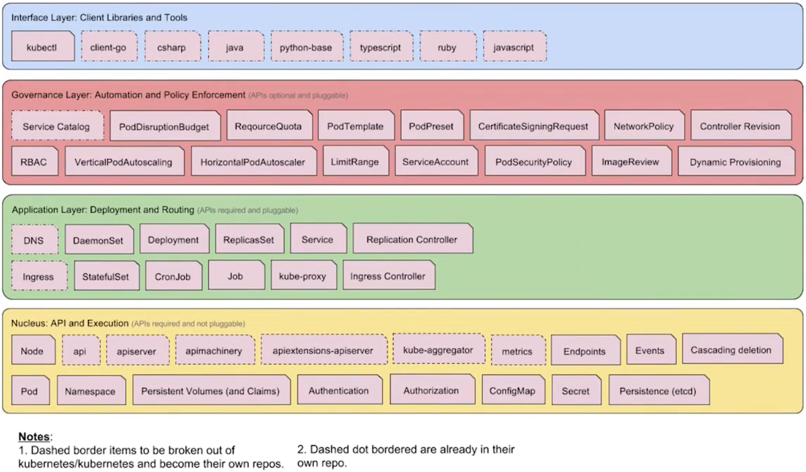
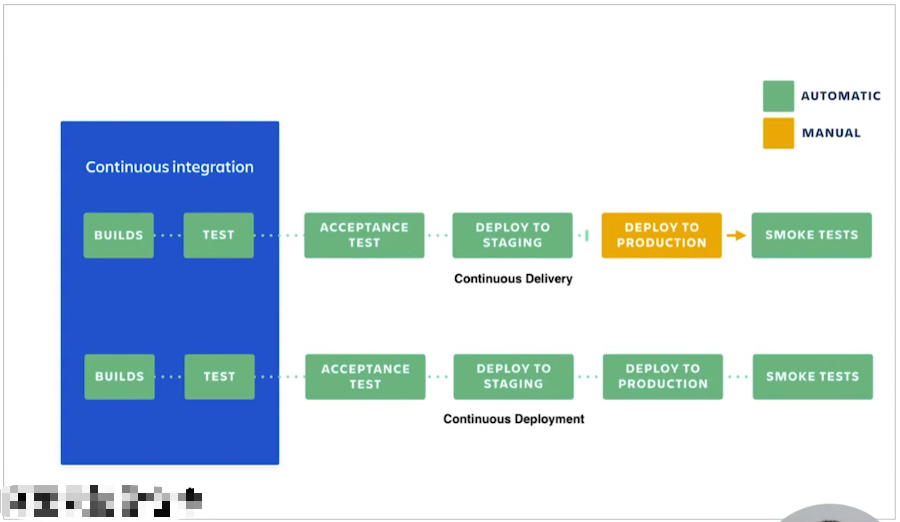
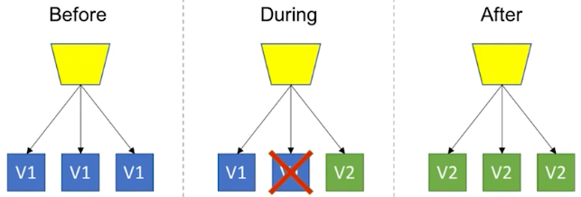

# 容器化部署
## 容器化 Django 应用
### 优势
- 效率提升
  - 开发环境可以复用。
- 简单
  - 一个命令搭建可以运行的开发环境。
- 环境隔离
  - 每个应用隔离的容器环境，无 Python/Pip 包版本冲突。


### 代码调整
- Settings 配置
  - `ALLOWED_HOSTS = ['*']`
- 配置项放到环境变更中，启动脚本改动
  ```shell
  # 原启动脚本
  $ cat start_docker_local.sh
  python manage.py runserver 0.0.0.0:8000 --settings=settings.local

  # 修改后启动脚本
  $ cat start_docker_local.sh
  python manage.py runserver 0.0.0.0:8000 $server_params 
  ```

### 构建小镜像
- Dockerfile
  - [Dockerfile](../Dockerfile)  
  - [.dockerignore](../.dockerignore)
- 构建镜像，指定 Dockerfile
  - `docker build -f Dockerfile-base -t wowkingah/django-recruitment-base:0.1 .`
- 构建镜像，基于 base 镜像构建镜像
  - `docker build -t wowkingah/django-recruitment:0.1 .`
- 交互运行
  - `docker run -it --rm -p 8000:8000 --entrypoint /bin/sh wowkingah/django-recruitment-base:0.1`
- 开发环境，指定本地源码目录
  - `docker run -it --rm -p 8000:8000 -v "$(pwd)":/data/recruitment --entrypoint /bin/sh wowkingah/django-recruitment-base:0.1`
- 开发环境，指定本地源码目录&环境变量
  - `docker run -it --rm -p 8000:8000 -v "$(pwd)":/data/recruitment --env server_params="--settings=settings.local" wowkingah/django-recruitment-base:0.1`


## 容器编排 - Docker Compose
Docker Compose，单机编排
- 在一台主机上，跑多个容器，且容器之间有调用关系。

在一个 `docker-compose.yml` 文件中配置 4 个容器：
- Web
  - Django 应用，使用 `start_docker_local.sh` 来启动；
- Redis
  - `Celery` 的 `Borker` 需要用到的数据存储；
- Celery
  - 异步任务 `worker`；
- Flower
  - 异步任务的监控应用。

### docker-compose-build
- 通过 build 的方式启动 docker-compose
  - [docker-compose-build.yml](../docker-compose-build.yml)
  - `docker-compose -f docker-compose-build.yml up -d`


### docker-compose
- 直接通过 images 启动
  - [docker-compose.yml](../docker-compose.yml)
  - `docker-compose up -d`
  - `docker-compose down`


## 容器编排 - kubernetes
kubernetes，多主机编排

### K8S 架构
- 客户端 kubectl 命令
- 集群节点
- Pod 运行在节点内
- Pod 里面运行容器


### K8S 核心组件



## 容器中应用监控
### 云环境的复杂性
- 应用被分布在容器上运行，大量容器不断的创建、销毁、升级；
- 应用的可观测性，可见性变得更加重要。

### 监控方案
- `kubectl` 命令行
- 可视化监控方案
  - GUI 的 Kubernetes Dashboard
  - 云厂商的控制台
  - Sentry
  - ELK
  - Prometheus


## 容器中应用日志
### 日志收集与查询的不同方案
- 使用 `kubelet` 收集容器化应用输出到标准输出的日志；
- 使用 `sidecar` 收集输出到文件中的日志，输出到标准输出 && `tail -f`
  - ELK/EFK 采集日志；
  - 阿里云 Logtail 日志采集。

### K8S 下各种日志
- Pod logs
- Node logs -> 宿主机的 `/var/log/containers` 目录
- K8S components logging(api server, scheduler ...)
- K8S events
- Audit logs

- K8S 默认会将容器的 `stdout` 和 `stderr` 录入 `node` 的 `/var/log/containers` 目录下；
- 而 K8S 组件的日志默认会放置在 `/var/log` 目录下。


## 容器中持续集成
### CI/CD 工作流程
- Build & Package
- Test
- Deployment
  


### CD 阶段不同的部署策略
- Rolling Upgrade
  - 滚动更新，多个实例，下线一台升级一台，直至升级完；
- Blue/Green Deployment
  - 蓝绿部署，部署到新集群，部署完切流量到新集群；
- Canary Deployment
  - 金丝雀部署，过程中新老版本共存，持续做灰度验证。
  


