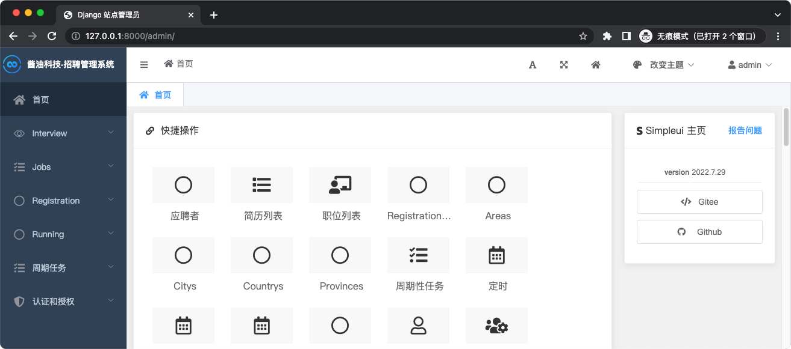
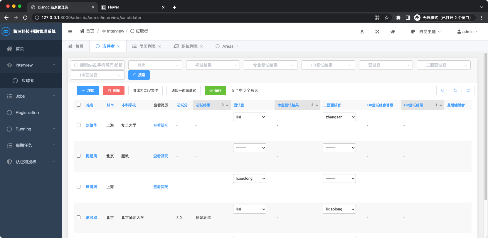
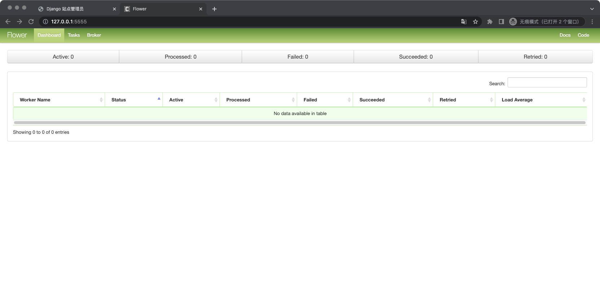

# 容器化部署
## 容器化 Django 应用
### 优势
- 效率提升
  - 开发环境可以复用。
- 简单
  - 一个命令搭建可以运行的开发环境。
- 环境隔离
  - 每个应用隔离的容器环境，无 Python/Pip 包版本冲突。


### 代码调整
- Settings 配置
  - `ALLOWED_HOSTS = ['*']`
- 配置项放到环境变更中，启动脚本改动
  ```shell
  # 原启动脚本
  $ cat start_docker_local.sh
  python manage.py runserver 0.0.0.0:8000 --settings=settings.local

  # 修改后启动脚本
  $ cat start_docker_local.sh
  python manage.py runserver 0.0.0.0:8000 $server_params 
  ```

### 构建小镜像
- Dockerfile
  - [Dockerfile](../Dockerfile)  
  - [.dockerignore](../.dockerignore)
- 构建镜像，指定 Dockerfile
  - `docker build -f Dockerfile-base -t wowkingah/django-recruitment-base:0.1 .`
- 构建镜像，基于 base 镜像构建镜像
  - `docker build -t wowkingah/django-recruitment:0.1 .`
- 交互运行
  - `docker run -it --rm -p 8000:8000 --entrypoint /bin/sh wowkingah/django-recruitment-base:0.1`
- 开发环境，指定本地源码目录
  - `docker run -it --rm -p 8000:8000 -v "$(pwd)":/data/recruitment --entrypoint /bin/sh wowkingah/django-recruitment-base:0.1`
- 开发环境，指定本地源码目录&环境变量
  - `docker run -it --rm -p 8000:8000 -v "$(pwd)":/data/recruitment --env server_params="--settings=settings.local" wowkingah/django-recruitment-base:0.1`




## 容器编排 - Docker Compose
Docker Compose，单机编排
- 在一台主机上，跑多个容器，且容器之间有调用关系。

在一个 `docker-compose.yml` 文件中配置 4 个容器：
- Web
  - Django 应用，使用 `start_docker_local.sh` 来启动；
- Redis
  - `Celery` 的 `Borker` 需要用到的数据存储；
- Celery
  - 异步任务 `worker`；
- Flower
  - 异步任务的监控应用。

### docker-compose-build
- 通过 build 的方式启动 docker-compose
  - [docker-compose-build.yml](../docker-compose-build.yml)
  - `docker-compose -f docker-compose-build.yml up -d`




### docker-compose
- 直接通过 images 启动
  - [docker-compose.yml](../docker-compose.yml)
  - `docker-compose up -d`
  - `docker-compose down`

