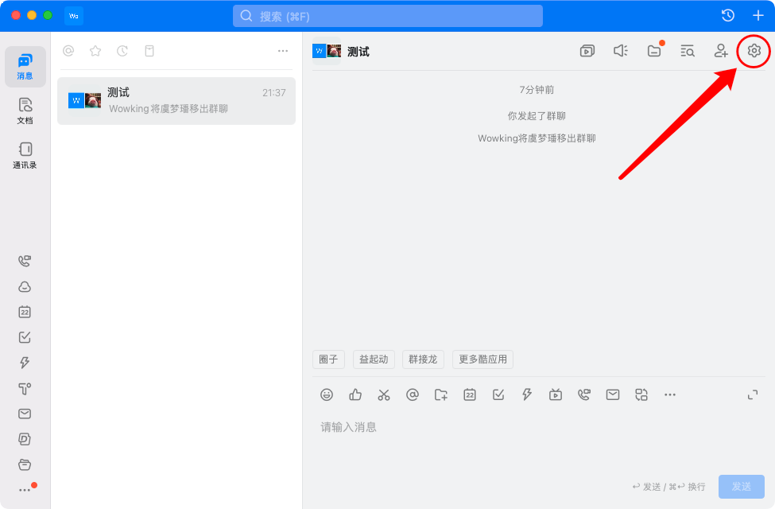
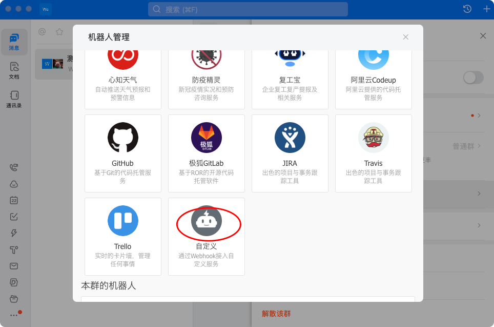
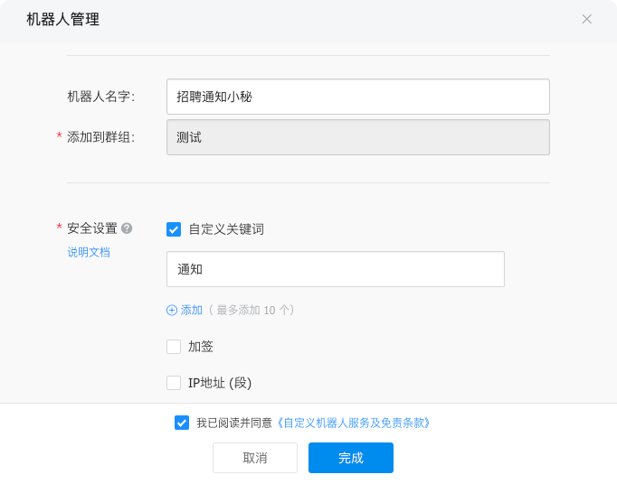
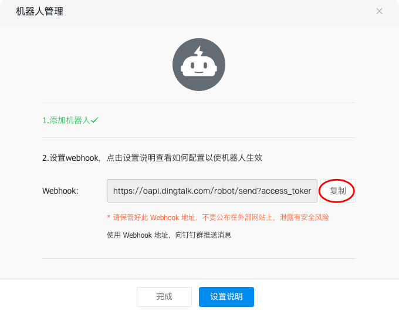
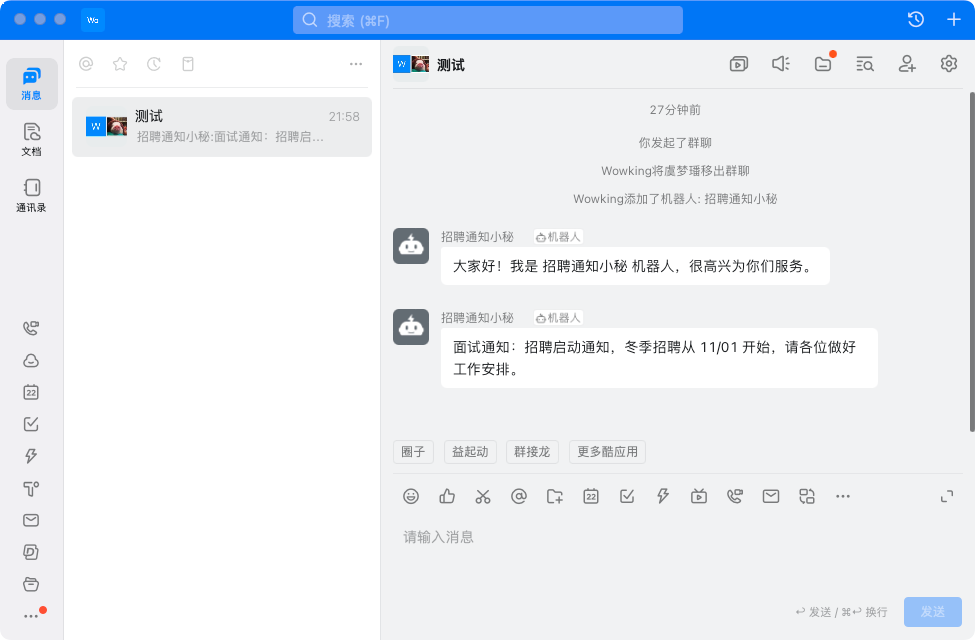

## 发送消息代码
`interview/dingtalk.py`

## 钉钉群添加机器人
- 群设置  
  

- 智能群助手 -> 添加机器人 -> 自定义  
  

- 机器人名字 -> 安全设置  
  

- 复制 Webhook 地址  
  

## 配置 WEB_HOOK
`settings/local.py`
> DINGTALK_WEB_HOOK = "https://oapi.dingtalk.com/robot/send?access_token=xxxx"

## 测试消息发送
```bash
$ python manage.py shell --settings=settings.local
>>> from interview import dingtalk
>>> dingtalk.send("招聘启动通知，冬季招聘从 11/01 开始，请各位做好工作安排。")
```

## 查看钉钉通知 

