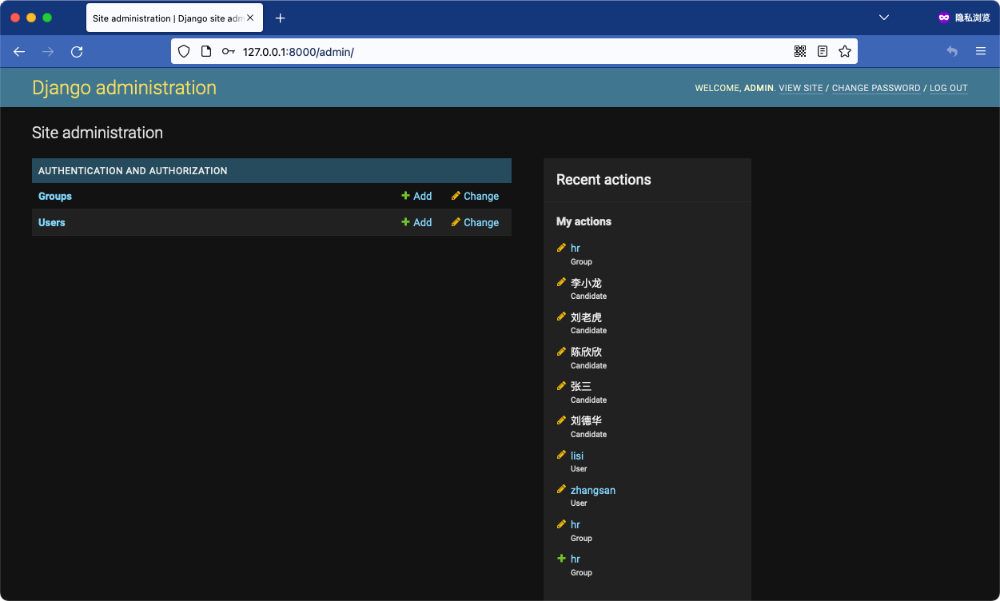
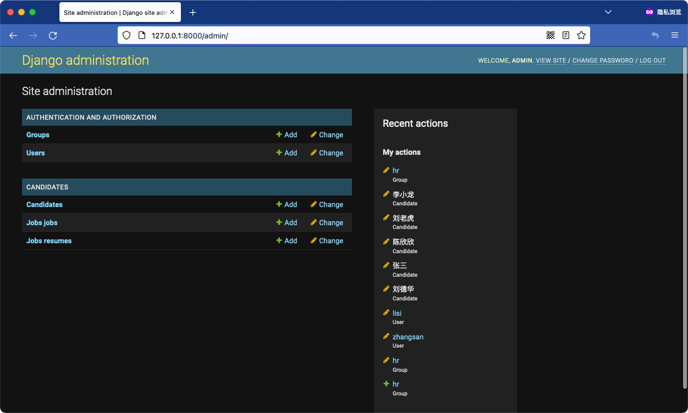
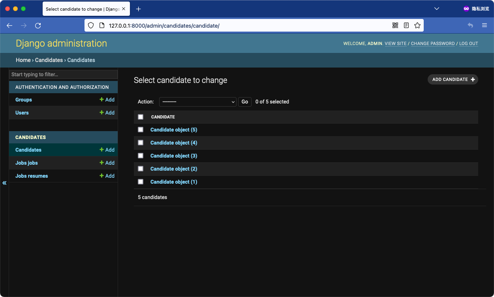
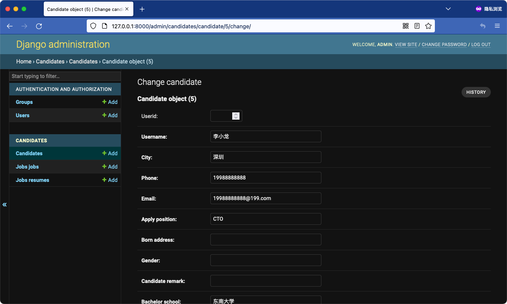
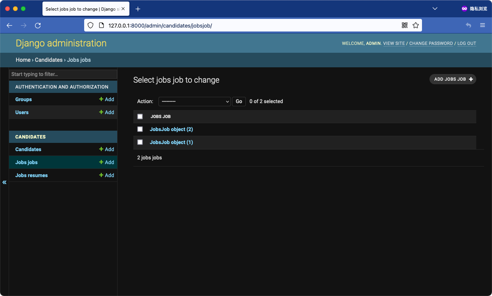
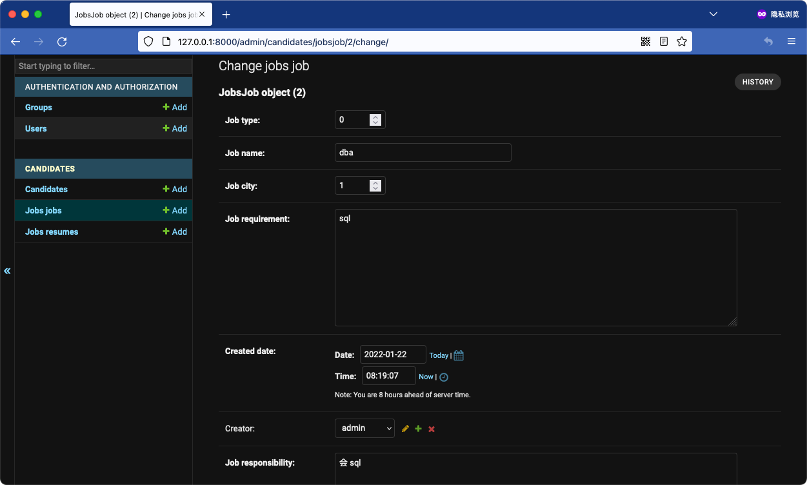

# Django 为已有系统生成管理后台
## 思路
1. 创建一个 Django 项目；
2. 连接老系统/项目数据库；
3. 将老系统数据库中的数据生成 Django Model；
4. 清理 Model 文件；
5. 注册 Admin、修改 Settings；
6. 运行测试。

# 模拟测试
## 为老系统创建 Django 项目
```bash
wowking@Wowkingah % django-admin startproject empmanager
wowking@Wowkingah % cd empmanager

# 模拟 recruitment 系统
wowking@Wowkingah empmanager % cp ../recruitment/db.sqlite3 .
wowking@Wowkingah empmanager % django-admin startapp candidates

# 运行
wowking@Wowkingah empmanager % python manage.py runserver 0.0.0.0:8000
```

## 测试访问
> 原 recruitment 系统中已存在 Django 后台相关数据，故不用 makemigrations 同步数据库结构。  



## 生成 Django Model
```bash
# 将老系统数据库中的数据生成 Model
wowking@Wowkingah empmanager % python manage.py inspectdb > candidates/models.py

# Model 处理，老系统 recruitment 中存在 Django 相关数据，删除掉 
wowking@Wowkingah empmanager % cat candidates/models.py
from django.db import models
from django.contrib.auth.models import User


class Candidate(models.Model):
    userid = models.IntegerField(unique=True, blank=True, null=True)
    username = models.CharField(max_length=16)
    city = models.CharField(max_length=32)
    phone = models.CharField(max_length=16)
    email = models.CharField(max_length=128)
    apply_position = models.CharField(max_length=135)
    born_address = models.CharField(max_length=135)
    gender = models.CharField(max_length=8)
    candidate_remark = models.CharField(max_length=135)
    bachelor_school = models.CharField(max_length=135)
    master_school = models.CharField(max_length=135)
    doctor_school = models.CharField(max_length=135)
    major = models.CharField(max_length=135)
    degree = models.CharField(max_length=135)
    test_score_of_general_ability = models.DecimalField(max_digits=10, decimal_places=5, blank=True, null=True)  # max_digits and decimal_places have been guessed, as this database handles decimal fields as float
    paper_score = models.DecimalField(max_digits=10, decimal_places=5, blank=True, null=True)  # max_digits and decimal_places have been guessed, as this database handles decimal fields as float
    first_score = models.DecimalField(max_digits=10, decimal_places=5, blank=True, null=True)  # max_digits and decimal_places have been guessed, as this database handles decimal fields as float
    first_learning_ability = models.DecimalField(max_digits=10, decimal_places=5, blank=True, null=True)  # max_digits and decimal_places have been guessed, as this database handles decimal fields as float
    first_advantage = models.TextField()
    first_disadvantage = models.TextField()
    first_result = models.CharField(max_length=256)
    first_recommend_position = models.CharField(max_length=256)
    first_remark = models.CharField(max_length=135)
    second_score = models.DecimalField(max_digits=10, decimal_places=5, blank=True, null=True)  # max_digits and decimal_places have been guessed, as this database handles decimal fields as float
    second_learning_ability = models.DecimalField(max_digits=10, decimal_places=5, blank=True, null=True)  # max_digits and decimal_places have been guessed, as this database handles decimal fields as float
    second_professional_competency = models.DecimalField(max_digits=10, decimal_places=5, blank=True, null=True)  # max_digits and decimal_places have been guessed, as this database handles decimal fields as float
    second_pursue_of_excellence = models.DecimalField(max_digits=10, decimal_places=5, blank=True, null=True)  # max_digits and decimal_places have been guessed, as this database handles decimal fields as float
    second_communication_ability = models.DecimalField(max_digits=10, decimal_places=5, blank=True, null=True)  # max_digits and decimal_places have been guessed, as this database handles decimal fields as float
    second_pressure_score = models.DecimalField(max_digits=10, decimal_places=5, blank=True, null=True)  # max_digits and decimal_places have been guessed, as this database handles decimal fields as float
    second_advantage = models.TextField()
    second_disadvantage = models.TextField()
    second_result = models.CharField(max_length=256)
    second_recommend_position = models.CharField(max_length=256)
    second_remark = models.CharField(max_length=135)
    hr_score = models.CharField(max_length=10)
    hr_responsibility = models.CharField(max_length=10)
    hr_communication_ability = models.CharField(max_length=10)
    hr_logic_ability = models.CharField(max_length=10)
    hr_potential = models.CharField(max_length=10)
    hr_stability = models.CharField(max_length=10)
    hr_advantage = models.TextField()
    hr_disadvantage = models.TextField()
    hr_result = models.CharField(max_length=256)
    hr_remark = models.CharField(max_length=256)
    creator = models.CharField(max_length=256)
    created_date = models.DateTimeField()
    modified_date = models.DateTimeField(blank=True, null=True)
    last_editor = models.CharField(max_length=256)
    first_professional_competency = models.DecimalField(max_digits=10, decimal_places=5, blank=True, null=True)  # max_digits and decimal_places have been guessed, as this database handles decimal fields as float
    # 外键 AuthUser 替换成系统 User 字段，并指定 related_name
    first_interviewer_user = models.ForeignKey(User, models.DO_NOTHING, related_name='first_interviewer_user', blank=True, null=True)
    hr_interviewer_user = models.ForeignKey(User, models.DO_NOTHING, related_name='hr_interviewer_user', blank=True, null=True)
    second_interviewer_user = models.ForeignKey(User, models.DO_NOTHING, related_name='second_interviewer_user', blank=True, null=True)

    class Meta:
        # 该对象实体不再跟数据库里的结构保持一致（该数据从数据库生成，同步会覆盖生产环境数据）
        managed = False
        db_table = 'candidate'


class JobsJob(models.Model):
    job_type = models.SmallIntegerField()
    job_name = models.CharField(max_length=250)
    job_city = models.SmallIntegerField()
    job_requirement = models.TextField()
    created_date = models.DateTimeField()
    creator = models.ForeignKey(User, models.DO_NOTHING, blank=True, null=True)
    job_responsibility = models.TextField()
    modified_date = models.DateTimeField()

    class Meta:
        managed = False
        db_table = 'jobs_job'


class JobsResume(models.Model):
    username = models.CharField(max_length=135)
    city = models.CharField(max_length=135)
    phone = models.CharField(max_length=135)
    email = models.CharField(max_length=135)
    apply_position = models.CharField(max_length=135)
    born_address = models.CharField(max_length=135)
    gender = models.CharField(max_length=135)
    bachelor_school = models.CharField(max_length=135)
    master_school = models.CharField(max_length=135)
    doctor_school = models.CharField(max_length=135)
    major = models.CharField(max_length=135)
    degree = models.CharField(max_length=135)
    created_date = models.DateTimeField()
    modified_date = models.DateTimeField()
    candidate_introduction = models.TextField()
    work_experience = models.TextField()
    project_experience = models.TextField()
    applicant = models.ForeignKey(User, models.DO_NOTHING, blank=True, null=True)

    class Meta:
        managed = False
        db_table = 'jobs_resume'

```

## 注册到 Admin
```bash
wowking@Wowkingah empmanager % cat candidates/admin.py
from django.contrib import admin

# Register your models here.
from .models import JobsJob, JobsResume, Candidate

admin.site.register(JobsResume)
admin.site.register(JobsJob)
admin.site.register(Candidate)
```

## 更新 Settings
```bash
wowking@Wowkingah empmanager % cat empmanager/settings.py
INSTALLED_APPS = [
    'django.contrib.admin',
    'django.contrib.auth',
    'django.contrib.contenttypes',
    'django.contrib.sessions',
    'django.contrib.messages',
    'django.contrib.staticfiles',
    'candidates',
]
```

## 启动老系统
```bash
wowking@Wowkingah empmanager % python manage.py runserver 0.0.0.0:8000
```

## 测试
- 查看候选人  




- 查看职位  


