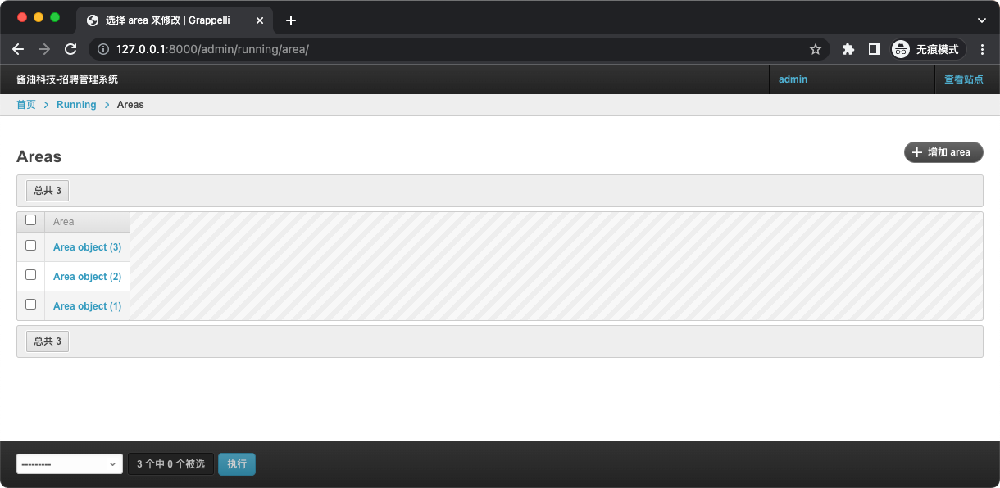
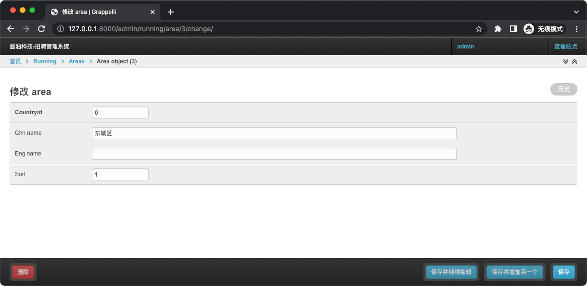

# 多数据库路由
## MySQL 环境
```shell
$ docker pull mysql:5.7 
# 指定 MySQL root 用户默认密码
$ docker run -itd -e MYSQL_ROOT_PASSWORD=123456 --name mysql -p 3306:3306 mysql:5.7

# 初始化模拟生产数据库环境
$ docker exec -it mysql /usr/bin/mysql -uroot -p123456
mysql> create database running;
mysql> grant all on *.* to recruitment identified by 'recruitment';

mysql> use running;
CREATE TABLE `area` (
  `areaid` int(10) unsigned NOT NULL AUTO_INCREMENT,
  `countryid` int(10) unsigned NOT NULL,
  `chn_name` varchar(64) DEFAULT NULL,
  `eng_name` varchar(64) DEFAULT NULL,
  `sort` tinyint(3) unsigned DEFAULT '1',
  PRIMARY KEY (`areaid`)
) ENGINE=InnoDB DEFAULT CHARSET=utf8mb4;

CREATE TABLE `city` (
  `cityid` int(10) unsigned NOT NULL AUTO_INCREMENT,
  `countryid` int(10) unsigned NOT NULL,
  `areaid` int(10) unsigned DEFAULT NULL,
  `provinceid` int(10) unsigned DEFAULT NULL,
  `chn_name` varchar(64) DEFAULT NULL,
  `eng_name` varchar(64) DEFAULT NULL,
  `sort` tinyint(3) unsigned DEFAULT '1',
  PRIMARY KEY (`cityid`)
) ENGINE=InnoDB DEFAULT CHARSET=utf8mb4;

CREATE TABLE `country` (
  `countryid` int(10) unsigned NOT NULL AUTO_INCREMENT,
  `provinceid` int(10) unsigned DEFAULT NULL,
  `chn_name` varchar(64) DEFAULT NULL,
  `eng_name` varchar(64) DEFAULT NULL,
  `country_logo` varchar(120) DEFAULT NULL,
  `sort` tinyint(3) unsigned DEFAULT '1',
  PRIMARY KEY (`countryid`)
) ENGINE=InnoDB DEFAULT CHARSET=utf8mb4;

CREATE TABLE `province` (
  `provinceid` int(10) unsigned NOT NULL AUTO_INCREMENT,
  `countryid` int(10) unsigned NOT NULL,
  `areaid` int(10) unsigned DEFAULT NULL,
  `chn_name` varchar(64) DEFAULT NULL,
  `eng_name` varchar(64) DEFAULT NULL,
  `sort` tinyint(3) unsigned DEFAULT '1',
  PRIMARY KEY (`provinceid`)
) ENGINE=InnoDB DEFAULT CHARSET=utf8mb4;

INSERT INTO `country` VALUES (1,1,'中国','China',NULL,NULL),(2,2,'美国','America',NULL,NULL);
INSERT INTO `province` VALUES (1,1,2,'北京市','Beijing',NULL),(2,1,2,'上海市','Shanghai',NULL),(3,1,3,'香港','HongKong',NULL);
INSERT INTO `city` VALUES (1,1,1,1,'北京市','Beijing',1),(2,1,1,2,'上海市','Shanghai',1),(3,1,1,3,'香港','HongKong',1);
INSERT INTO `area` VALUES (1,0,'北京市','',1),(2,0,'北京城区','',1),(3,0,'东城区','',1);
```

## MacOS 开发环境
```shell
# 安装 MySQL 客户端
$ brew install openssl mysql-client
$ echo 'export PATH="/usr/local/opt/mysql-client/bin:$PATH"' >> ~/.zshrc
$ source ~/.zshrc

$ pip install mysqlclient
```

## 实现步骤
### 配置 settings
```shell
$ cat settings/base.py
...
DATABASES = {
    'default': {
        'ENGINE': 'django.db.backends.sqlite3',
        'NAME': BASE_DIR / 'db.sqlite3',
    },
    'running': {
        'ENGINE': 'django.db.backends.mysql',
        'NAME': 'running',
        'USER': 'recruitment',
        'PASSWORD': 'recruitment',
        'HOST': '127.0.0.1',
        'PORT': '3306',
    }
}
```

### 创建新应用
`$ django-admin startapp running`

### 指定表生成 Model
`$ python manage.py inspectdb --database=running --settings=settings.local area city country province > running/models.py`

### 注册 Admin
[running/admin.py](../running/admin.py)

### 定义数据库路由
[settings/router.py](../settings/router.py)

### 应用注册与路由
[settings/router.py](../settings/base.py)

## 查看效果




## 功能优化：下拉搜索
[running/models.py](../running/models.py)  
[running/admin.py](../running/admin.py)
