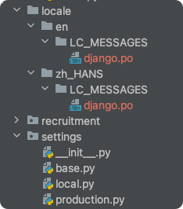
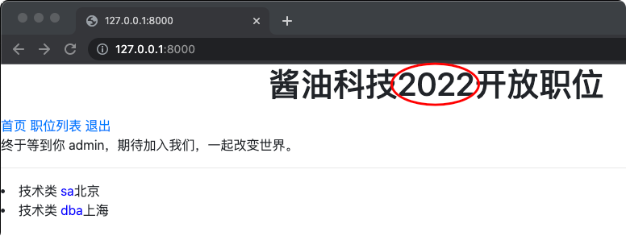
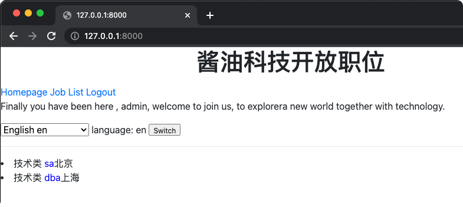
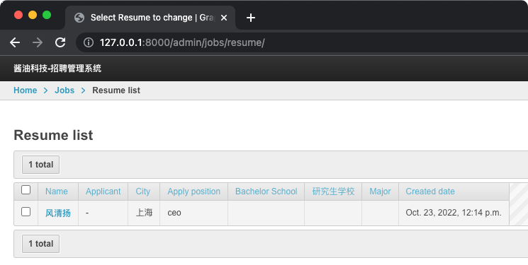
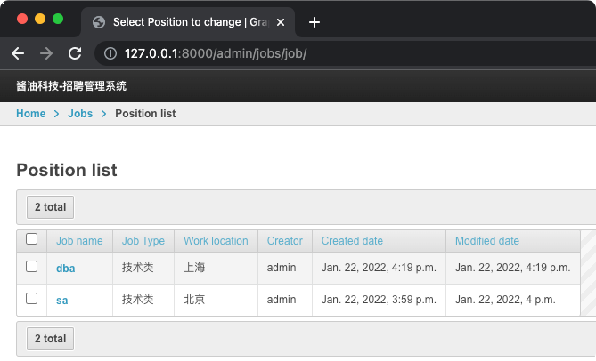

# Django 多语言支持
## Django 识别多语言
1. Django 按顺序从 `URL` -> `Cookie` -> `浏览器Header` 中找是否有语言标记；
2. 如果都没有，则使用系统默认设置的 `LANGUAGE_CODE`。

## `models` 支持  
- 引入 `gettext_lazy` 包；
- 调用方法完成实体翻译；
- [jobs/models.py](../jobs/models.py)

## `templates` 支持
- 导入 `i18n`；
- 使用 translate 获取某一个 Key 对应的资源；
- [jobs/templates/base.html](../jobs/templates/base.html)

## 生成多语言资源文件
```bash
# 如果本地环境没有 gettext，先安装，以 MacOS 为例
$ brew install gettext

# 创建 locale 目录
$ mkdir locale

# 指定语言
$ django-admin makemessages -l zh_HANS -l en
```


> 每个 Key 对应 django.po 里的 msgid，每个 msgid 有个 msg值（msgstr）。  
> 当 msgstr 为空时，默认使用 msgkey 的文本。即，如果 msgkey 是中文时，可以不填 msgstr。  

## 修改多语言翻译文本
```bash
$ vim locale/zh_HANS/LC_MESSAGES/django.po 
$ vim locale/en/LC_MESSAGES/django.po
```

## 将多语言编译成二进制内容
`$ django-admin compilemessages`

## URL 支持多语言映射
[jobs/urls.py](../jobs/urls.py)

## Settings 添加多语言配置
[settings/base.py](../settings/base.py)  


## 新增语言切换按钮
- [jobs/templates/base.html](../jobs/templates/base.html)






