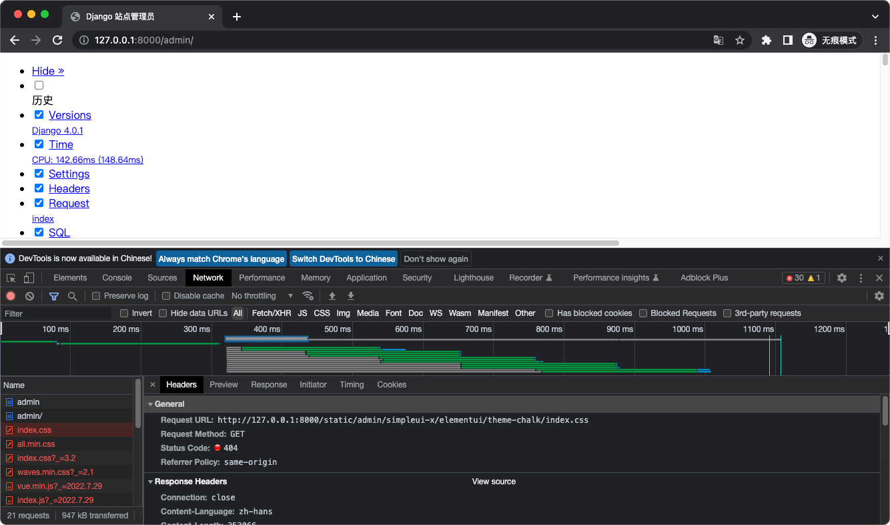

# 生产环境部署准备
## 必须调整的关键配置
- DEBUG
  - 在生产环境中设置为 False（DEBUG = False）
  - 避免在 Web 页面上显示敏感的调试跟踪和变更信息。
- SECRET_KEY
  - 用于 `CRSF` 保护的随机值。
  - 生成 SECRET KEY `python -c 'from django.core.management.utils import get_random_secret_key; print(get_random_secret_key())'
- ALLOWED_HOSTS
  - 生产环境必须设置为允许访问的域名。

## 密钥的存储和管理
- 从环境变量读取配置，或从配置文件中读取
```python
import os

DEBUG = False
SECRET_KEY = os.environ.get('DJANGO_SECRET_KEY', 'xxx')
ALLOWED_HOSTS = ["127.0.0.1", "github.com"]
```
- 从 `KMS` 系统中读取配置的密钥
  - 自己部署的 `KMS` 系统
  - 云服务的 `KMS` 服务：阿里云/AWS

## 部署前安全检查
`$ python manage.py check --deploy`

## 部署到生产环境
### 静态文件的托管环境
- 静态内容 Web 服务器：Apache/Nginx
- CDN 服务器

### collectstatic 工具
用来收集静态资源文件，`settings` 中的相关配置：
- STATIC_URL
  - 能够访问到静态文件的 URL 路径。
- STATIC_ROOT
  - `collectstatic` 工具用来保存收集到的项目引用到的任何静态文件的路径。
- STATICFILES_DIRS
  - 列出 `Django` 的 `collectstatic` 工具应该搜索静态文件的其他目录。 

`$ python manage.py collectstatic --settings=settings.local`
收集完成后，可将这些静态文件上传到托管文件的服务器/CDN.

### Django 应用容器
应用容器不提供静态资源。
- 同步应用
  - uWSGI
    - `C` 实现的 `Python Web` 容器；
    - `Web` 服务器 `Apache/Nginx` 与 `django-uwsgi` 进程通信来提供动态的内容。
  - gunicorn
    - 纯 `Python` 实现的高性能 `Python` 应用容器，无外部依赖，简单容易配置；
    - 还没遇到性能问题的时候，推荐使用。
- 异步应用
使用异步应用容器时，代码里不能直接使用同步代码，所有调用都应该是异步。  
`Django` 框架里自带的类自动做了兼容，默认会把同步调用转成异步调用。
  - Daphne
    - `twisted` 实现。
  - Hypercorn
    - 基于 `sans-io hyper`、`h11`、`h2`、`wsproto` 实现。
  - Uvicorn
    - 基于 `uvloop` 和 `httptools` 实现。

## 启动服务器
- 同步应用服务器，以 `gunicorn` 为例。
```shell
$ python -m pip install gunicorn
$ export DJANGO_SETTINGS_MODULE=settings.local
# 启动 3 个 worker 进程，绑定到本机的 8000 端口
$ gunicorn -w 3 -b 127.0.0.1:8000 recruitment.wsgi:application
```


- 异步应用服务器，以 `uvicorn` 为例。
```shell
$ python -m pip install uvicorn
$ export DJANGO_SETTINGS_MODULE=settings.local
$ uvicorn recruitment.asgi:application --workers 3 
```
