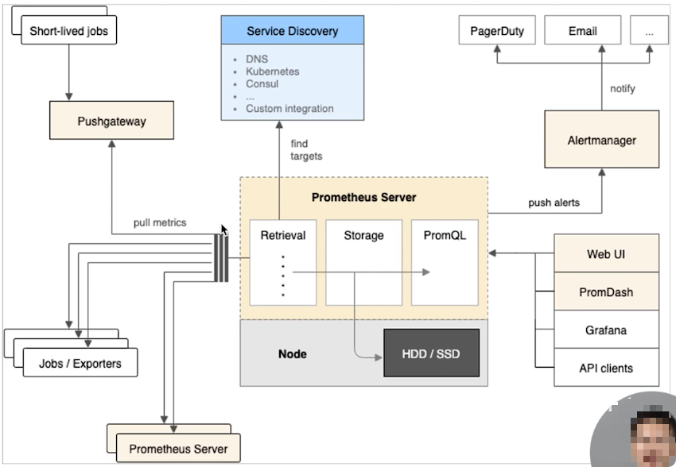
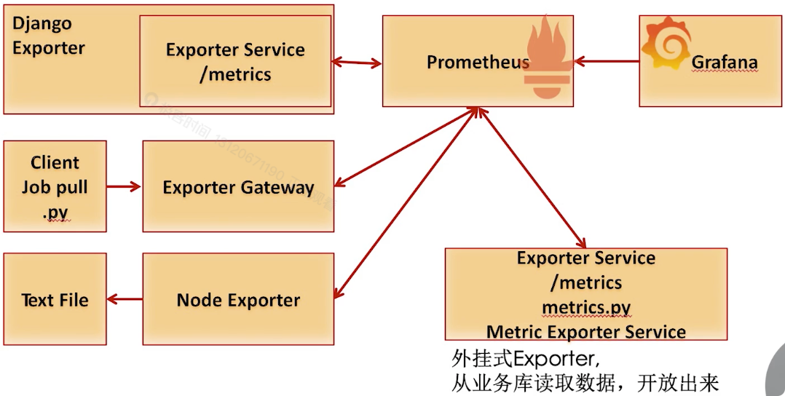
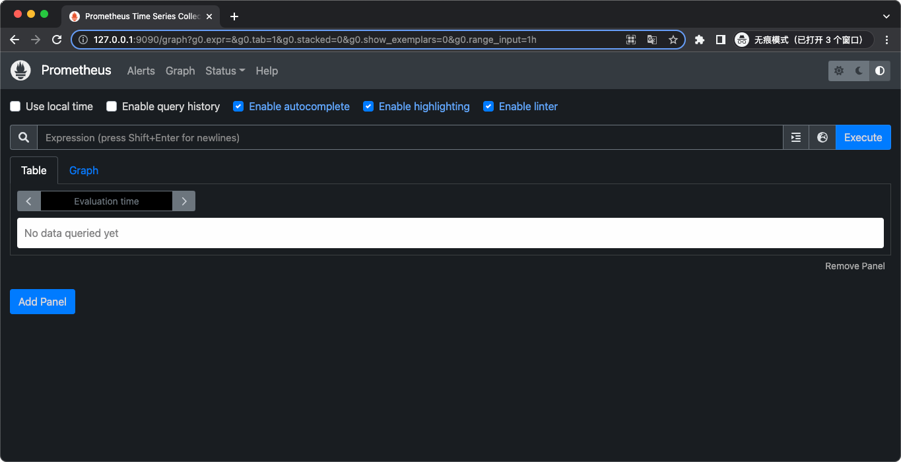
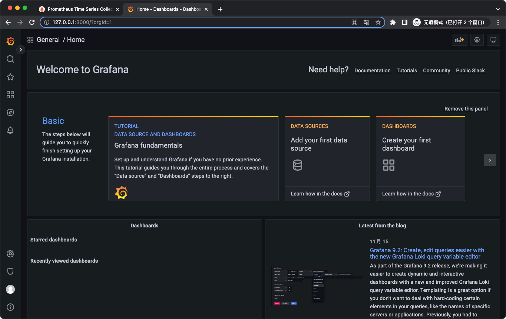
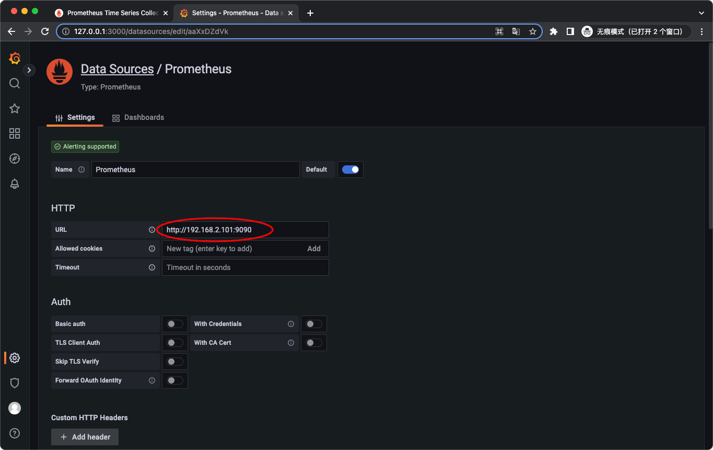
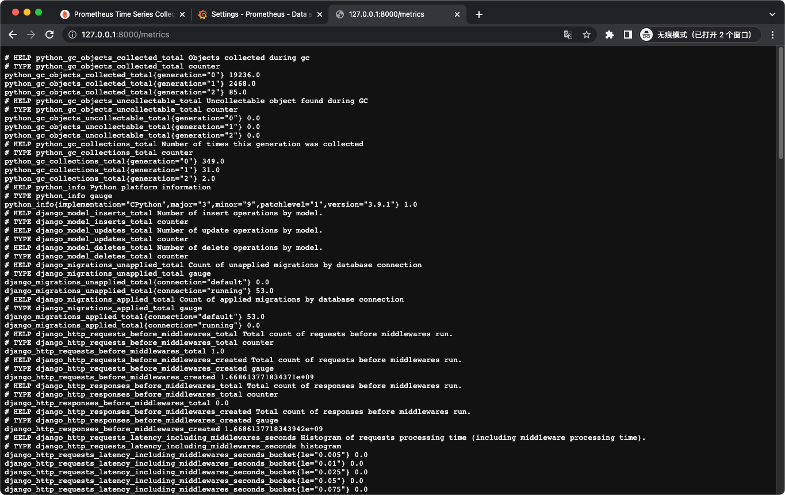
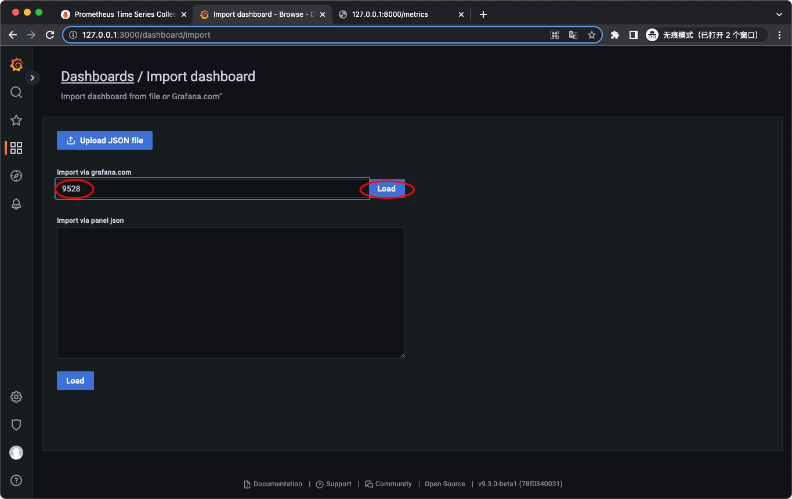
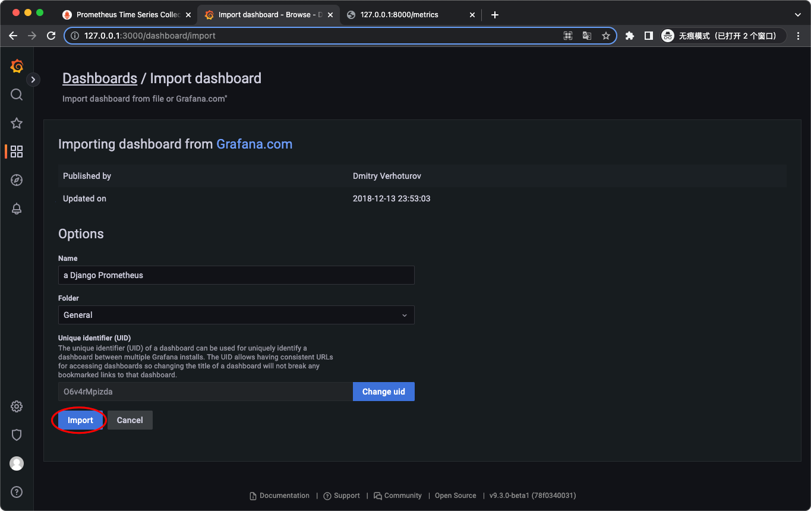
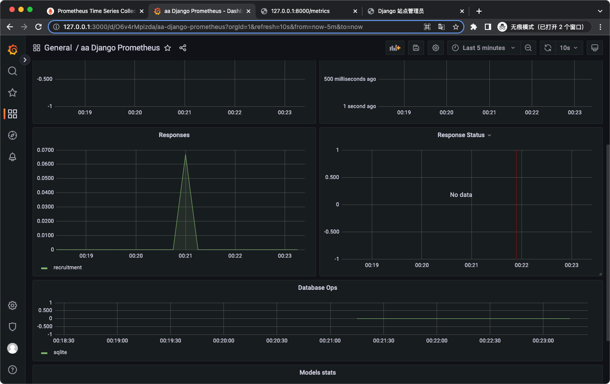

# 告警趋势可视化：Prometheus & Grafana
## Prometheus 数据类型
- Counter
  - 计数器，总是增长的整数值；
  - 请求数、订单量、错误数等。
- Gauge
  - 可以上下波动的计量值；
  - 温度、内存使用量、处理中的请求。
- Summary
  - 提供观测样本的摘要，包含样本数量、样本值的和；
  - 滑动窗口计算：请求耗时、响应数据大小。
- Histogram
  - 把观测值放到配置好的桶中做统计，请求耗时，响应数据大小等。

## Prometheus & Grafana 架构
- Prometheus 服务
  - 采集和存储时序数据
- 客户端类库
  - 用作注入应用端代码
- PUsh gateway
  - 用于采集朝生暮死的作业数据
- 特殊用途的 Exporter Service
  - 如 Nginx/HAProxy/StatsD 等
- Alertmanager
  - 处理告警  


## Prometheus & Grafana 调用关系


## Prometheus & Grafana 接入
### 安装 Prometheus & Grafana
```shell
# Prometheus
$ docker run -itd --name prom -p 9090:9090 prom/prometheus
# Grafana，默认用户密码：admin/123456
$ docker run -itd --name grafana -p 3000:3000 grafana/grafana
```



### 配置 Grafana
Grafana -> Configuration -> Data sources -> Prometheus


## Django prometheus
### 安装
```shell
$ pip install django-prometheus
```

### 配置
```shell
$ cat settings/base.py
MIDDLEWARE = [
    # 最前面加 PrometheusBeforeMiddleware，最后面加 PrometheusAfterMiddleware
    'django_prometheus.middleware.PrometheusBeforeMiddleware',
    # 从下至下依次执行
    'interview.performance.PerformanceAndExceptionLoggerMiddleware',
    # 'interview.performance.performance_logger_middleware',
    # Debug toolbar
    'debug_toolbar.middleware.DebugToolbarMiddleware',
    'django.middleware.security.SecurityMiddleware',
    'django.contrib.sessions.middleware.SessionMiddleware',
    # 多语言中间件支持，加在 sessions 与 common 之间
    'django.middleware.locale.LocaleMiddleware',
    # common 前后各加一条 Cache 中间件
    'django.middleware.cache.UpdateCacheMiddleware',
    'django.middleware.common.CommonMiddleware',
    'django.middleware.cache.FetchFromCacheMiddleware',
    'django.middleware.csrf.CsrfViewMiddleware',
    'django.contrib.auth.middleware.AuthenticationMiddleware',
    'django.contrib.messages.middleware.MessageMiddleware',
    'django.middleware.clickjacking.XFrameOptionsMiddleware',
    'django_prometheus.middleware.PrometheusAfterMiddleware',
]

INSTALLED_APPS = [
    # 主题需加在 admin 之前
    'simpleui',
    'grappelli',
    'bootstrap4',
    'registration',
    'django_prometheus',
    'django.contrib.admin',
# ...
]

DATABASES = {
    'default': {
        # 监控数据库
        'ENGINE': 'django_prometheus.db.backends.sqlite3',
        'NAME': BASE_DIR / 'db.sqlite3',
    },
}

# url
$ cat recruitment/urls.py
urlpatterns = [
    path("", include("jobs.urls")),
    path("grappelli/", include("grappelli.urls")),
    path('admin/', admin.site.urls),
    path('accounts/', include('registration.backends.simple.urls')),

    # rest api & api auth(login logout)
    path('api/', include(router.urls)),
    path('api-auth/', include('rest_framework.urls')),
    
    # prometheus
    path('', include('django_prometheus.urls')),
]

# settings
$ cat settings/local.py
ALLOWED_HOSTS = ["localhost", "127.0.0.1", "192.168.2.101"]
```

### 查看 metrics
`http://127.0.0.1:8000/metrics`


### 修改 Prometheus 的 Django 数据源
```shell
# 添加 job
$ docker exec -it prom vi /etc/prometheus/prometheus.yml
scrape_configs:
  # The job name is added as a label `job=<job_name>` to any timeseries scraped from this config.
  - job_name: "prometheus"

    # metrics_path defaults to '/metrics'
    # scheme defaults to 'http'.

    static_configs:
      - targets: ["localhost:9090"]

  # add job
  - job_name: "recruitment"
    static_configs:
      - targets: ["192.168.2.101:8000",]
```

### Grafana 可视化
使用 Dashboard 模板 `https://grafana.com/grafana/dashboards/9528`
Grafana -> Dashboards -> Browse -> New -> Import



