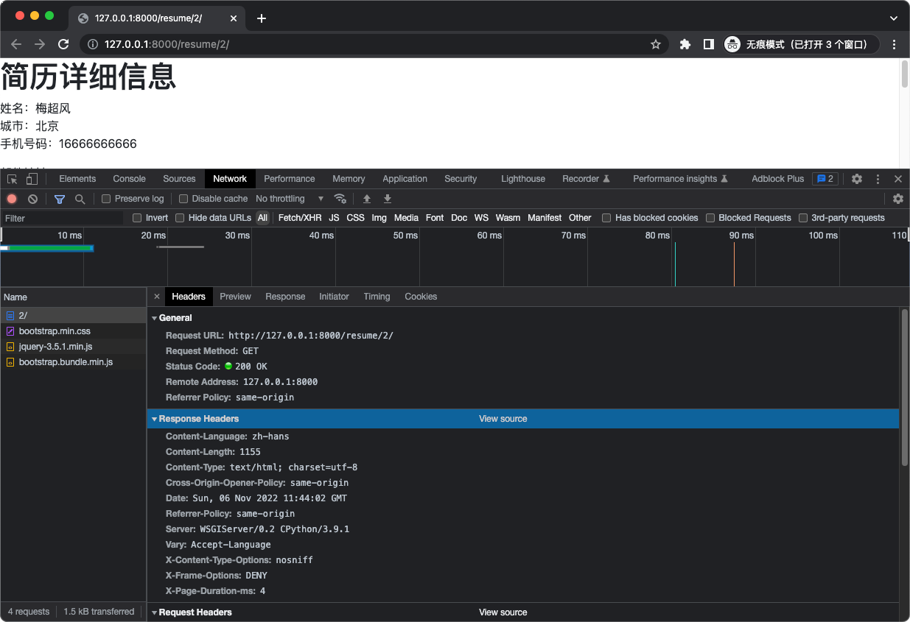
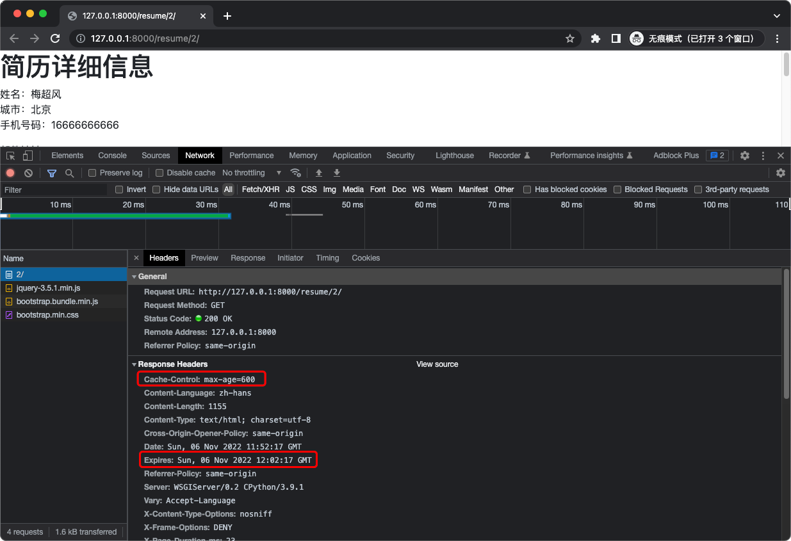
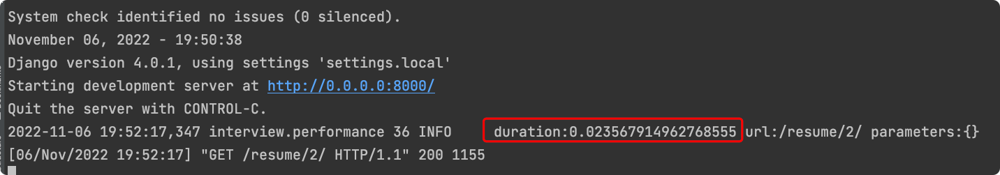
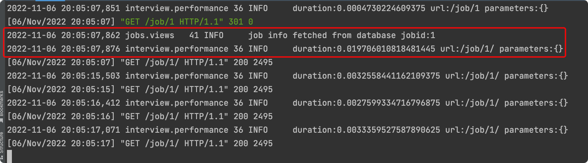

# Django Redis
## Redis 服务环境
```shell
$ docker pull redis
# 指定 Redis 端口为 16379
$ docker run -itd --name redis -p 16379:6379 redis
```

## Django Redis
### 安装
```shell
$ pip install django-redis
```

## 配置 Settings
```shell
$ cat settings/local.py
CACHES = {
    "default": {
        "BACKEND": "django_redis.cache.RedisCache",
        "LOCATION": "redis://127.0.0.1:16379/1",
        "TIMEOUT": 300,
        "OPTIONS": {
            "CLIENT_CLASS": "django_redis.client.DefaultClient",
            # "PASSWORD": "123456",
            # Redis 连接超时时间，单位 s
            "SOCKET_CONNECT_TIMEOUT": 5,
            # 每次读取数据超时时间，单位 s
            "SOCKET_TIMEOUT": 5,
        }
    }
}
```

### 没启用缓存时效果


## 启用整站缓存
### 配置 settings
```shell
$ cat settings/base.py
MIDDLEWARE = [
...
    # common 前后各加一条 Cache 中间件
    'django.middleware.cache.UpdateCacheMiddleware',
    'django.middleware.common.CommonMiddleware',
    # 先从缓存取数据
    'django.middleware.cache.FetchFromCacheMiddleware',
]
```

### 查看启用缓存后效果
默认缓存时间为 10 分钟。

从系统日志中查看页面响应时间


## 验证是否走缓存
### 记录数据库操作日志
[jobs/views.py](../jobs/views.py)

### 测试访问
只有首次访问会从数据库读数据，响应时间从 19.7ms 提升到 3.25ms

