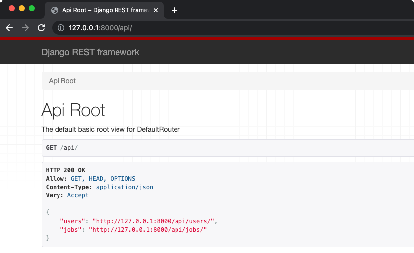
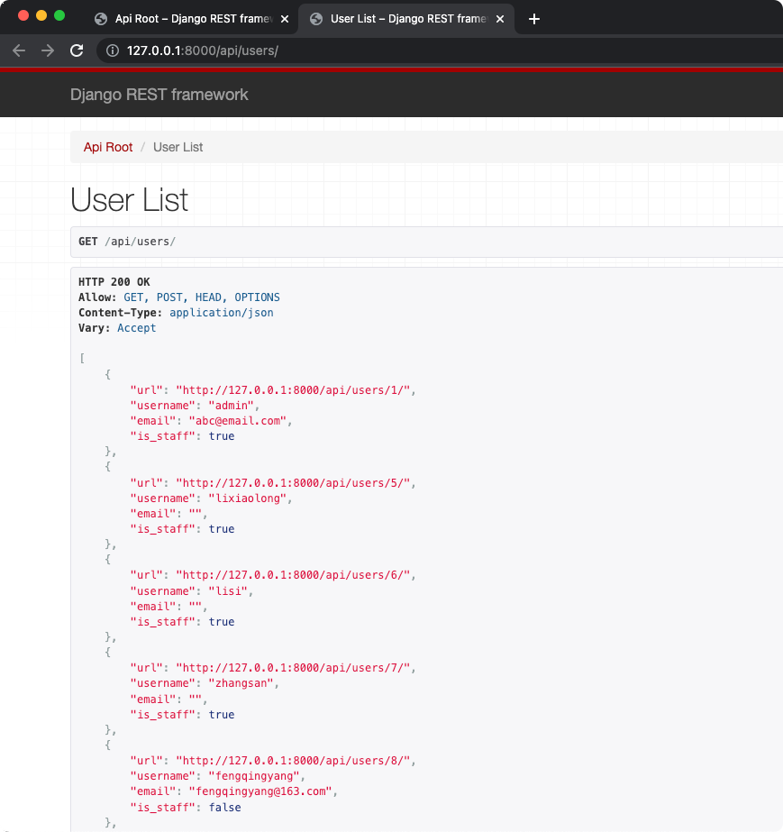
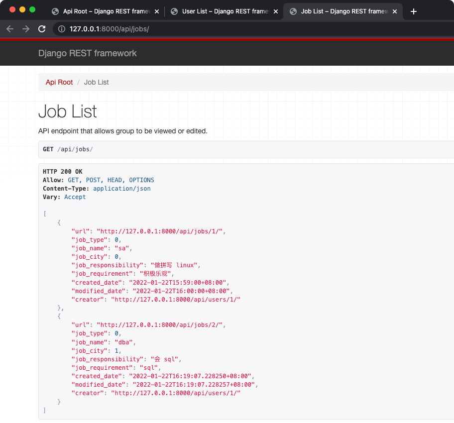

# Django REST Framework
## 安装
```bash
$ pip install djangorestframework

# Markdown support for the browsable API.
$ pip install markdown

# Filtering support
$ pip install django-filter
```

## 创建 URL 路由
[recruitment/urls.py](../recruitment/urls.py)

## 配置
### 配置 URL
```shell
$ cat recruitment/urls.py
urlpatterns = [
...
    # rest api & api auth(login logout)
    path('api/', include(router.urls)),
    path('api-auth/', include('rest_framework.urls')),
]
```

### 配置 settings
```shell
$ cat settings/base.py
INSTALLED_APPS = [
...
    'rest_framework',
]

REST_FRAMEWORK = {
    # Use Django's standard `django.contrib.auth` permissions,
    # or allow read-only access for unauthenticated users.
    'DEFAULT_PERMISSION_CLASSES': [
        'rest_framework.permissions.DjangoModelPermissionsOrAnonReadOnly'
    ]
}
```

## 访问 API


### 访问 Users API


### 访问 Jobs API


### 通过 curl 方式访问 API
```shell
$ curl http://127.0.0.1:8000/api/jobs/1/
{"url":"http://127.0.0.1:8000/api/jobs/1/","job_type":0,"job_name":"sa","job_city":0,"job_responsibility":"做拼写 linux","job_requirement":"积极乐观","created_date":"2022-01-22T15:59:00+08:00","modified_date":"2022-01-22T16:00:00+08:00","creator":"http://127.0.0.1:8000/api/users/1/"}
```
