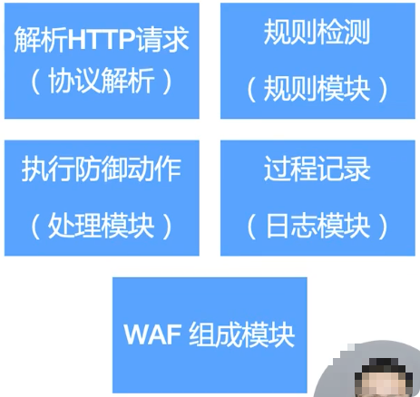
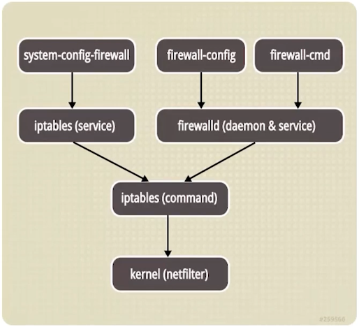
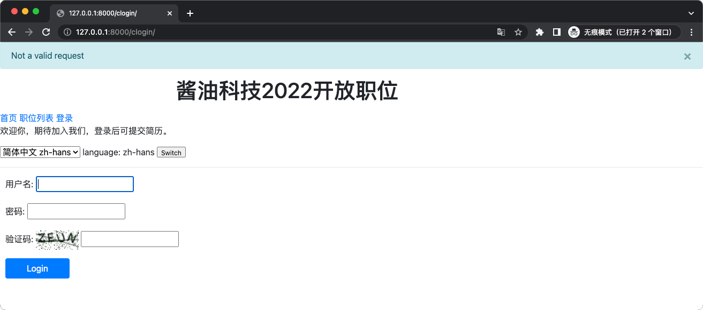
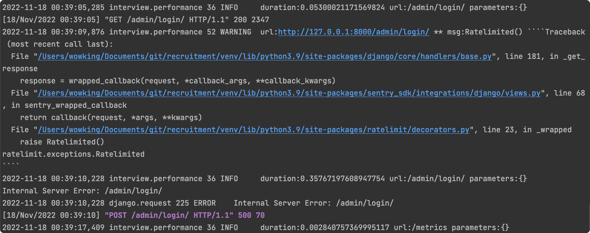
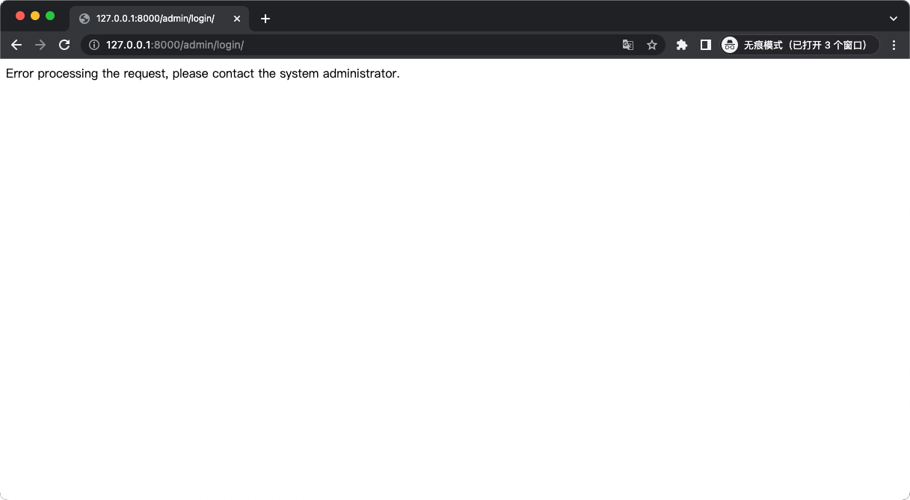

# 生产环境中的安全
## 生产环境安全要考虑的因素
- 防火墙
  - 把攻击挡在外面，建立安全区。
- 应用安全
  - 密码攻击&访问限流 - 防恶意攻击。
- 架构安全
  - 部署架构的安全性，应用架构安全设计。
- 数据安全
  - SSL，敏感数据架构与日志脱敏。
- 密码安全与业务安全
  - 权限控制&密码安全策略。

## 防火墙的类别
1. 硬件防火墙
2. WAF 防火墙
3. 操作系统防火墙

### WAF 防火墙
WAF：Web application firewall，基于预先定义的规则，如预先定义的正则表达式的黑名单，不安全 URL 请求等。
- 防止 SQL 注入、XSS、SSRF 等 Web 攻击；
- 防止 CC 攻击，屏蔽常见的扫描黑客工具，扫描器；
- 屏蔽异常的网络请求，屏蔽图片附件类目录 php 执行权限；
- 防止 Web shell 上传。  


### 系统防火墙
- iptables
  - Linux 原始自带的防火墙工具。
- ufw
  - Ubuntu 的防火墙工具 ufw. uncomplicated firewall 的简称，简单防火墙。
- firewalld
  - CentOS 的防火墙工具。  


# 应用安全
## 防恶意密码攻击策略
在用户连续登录 n 次失败后，要求输入验证码登录。

## 可选方案
使用 `simple captcha` 插件。

### 安装
```shell
$ pip install django-simple-captcha

# settings
$ cat settings/base.py
INSTALLED_APPS = [
    'interview',
    'running',
    'rest_framework',
    'captcha',
#..
]
```

### views
[recruitment/views.py](../recruitment/views.py)

### templates
[recruitment/templates/login.html](../recruitment/templates/login.html)

### urls
[recruitment/urls.py](../recruitment/urls.py)

### 注册模板与迁移数据
```shell
$ cat settings/base.py
TEMPLATES = [
    {
        'BACKEND': 'django.template.backends.django.DjangoTemplates',
        # 添加登录的模板页路径
        'DIRS': [os.path.join(BASE_DIR, 'recruitment/templates')],
        'APP_DIRS': True,
        'OPTIONS': {
            'context_processors': [
                'django.template.context_processors.debug',
                'django.template.context_processors.request',
                'django.contrib.auth.context_processors.auth',
                'django.contrib.messages.context_processors.messages',
            ],
        },
    },
]

# migrate
$ python manage.py makemigrations & python manage.py migrate
```

### 验证


## 访问限流 - 防恶意攻击
- Rest Framework API 限流
- 应用限流：对页面的访问频次进行限流

### Rest API 限流
- 可以对匿名用户，具名用户进行限流
- 可以设置峰值流量（如每分钟 60 次请求）
- 可以设置连续一段时间的流量限制（比如每天 3000 次）
```python
REST_FRAMEWORK = {
    'DEFAULT_THROTTLE_CLASSES': [
        'example.throttles.BurstRateThrottle',
        'example.throttles.SustainedRateThrottle'
    ],
    'DEFAULT_THROTTLE_RATES': {
        'burst': '60/min',
        'sustained': '3000/day'
    }
}
```

### 应用限流
对页面的访问频次进行限流。
示例策略：一分钟最多请求 5 次登录页，防止暴力攻击登录页。

### 可选方案
使用 `django-ratelimit` 插件。

### 安装
```shell
$ pip install django-ratelimit
```

### views
```shell
# cat recruitment/views.py
@ratelimit(key='ip', rate='5/m', block=True)
def login_with_captcha(request):
    ...
```

### 验证


