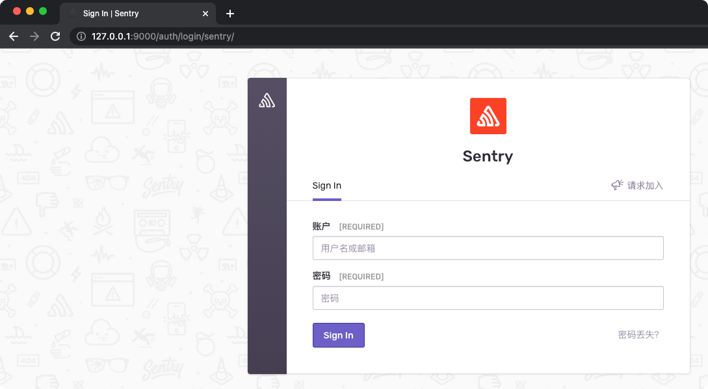
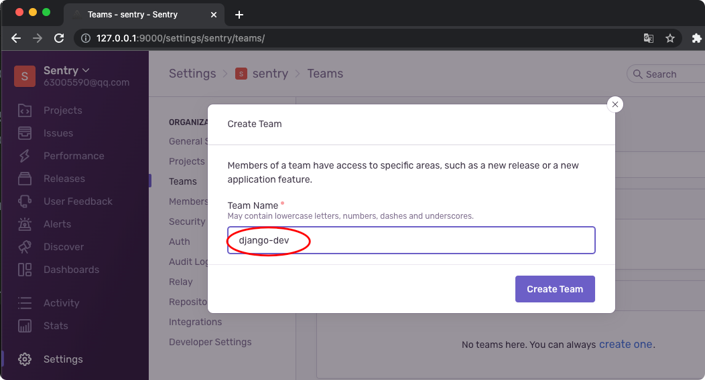
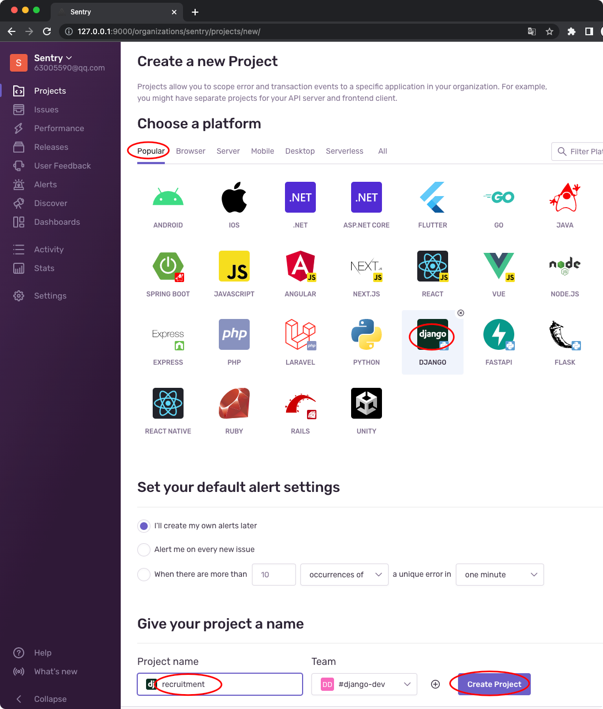
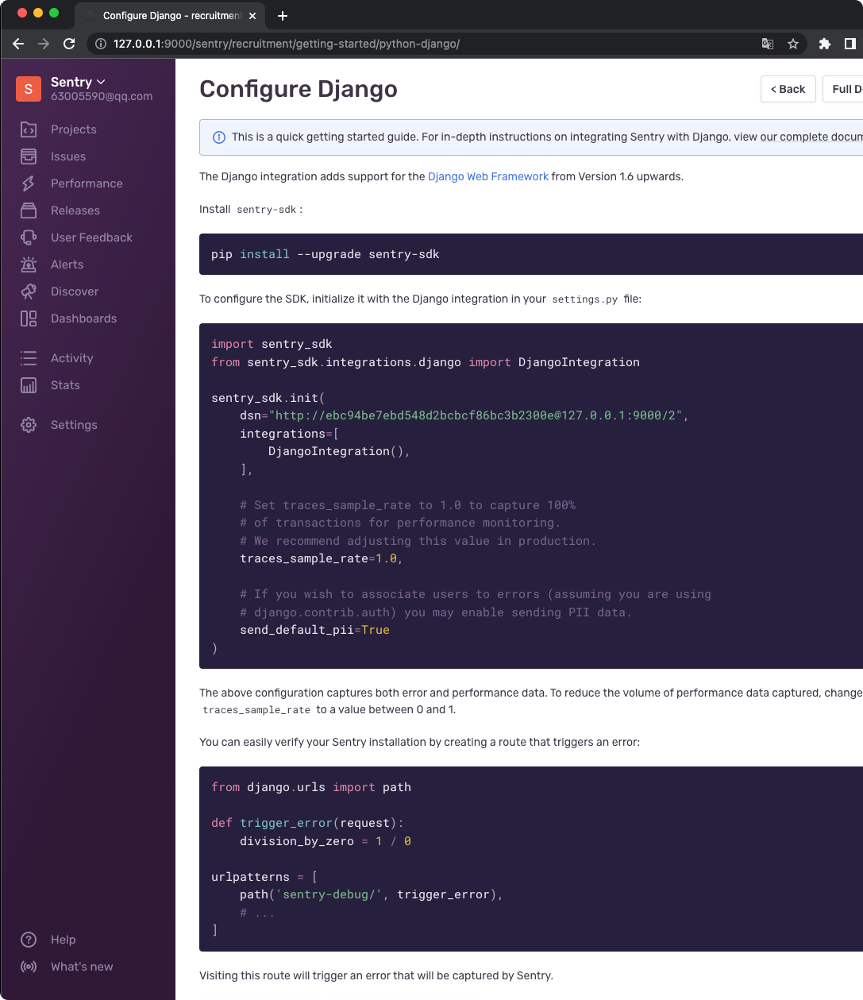
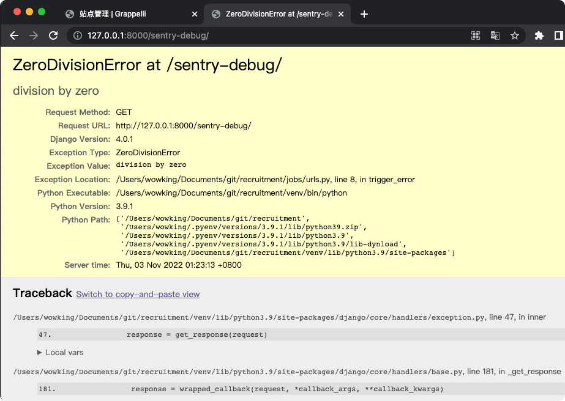
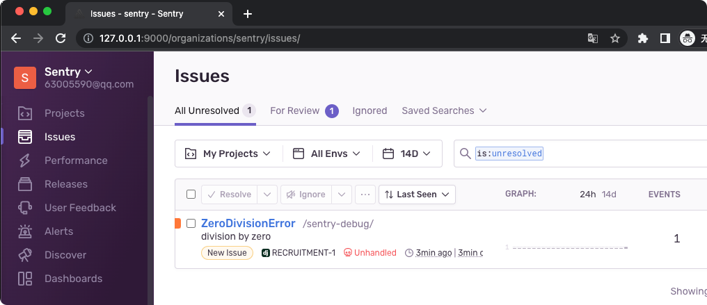
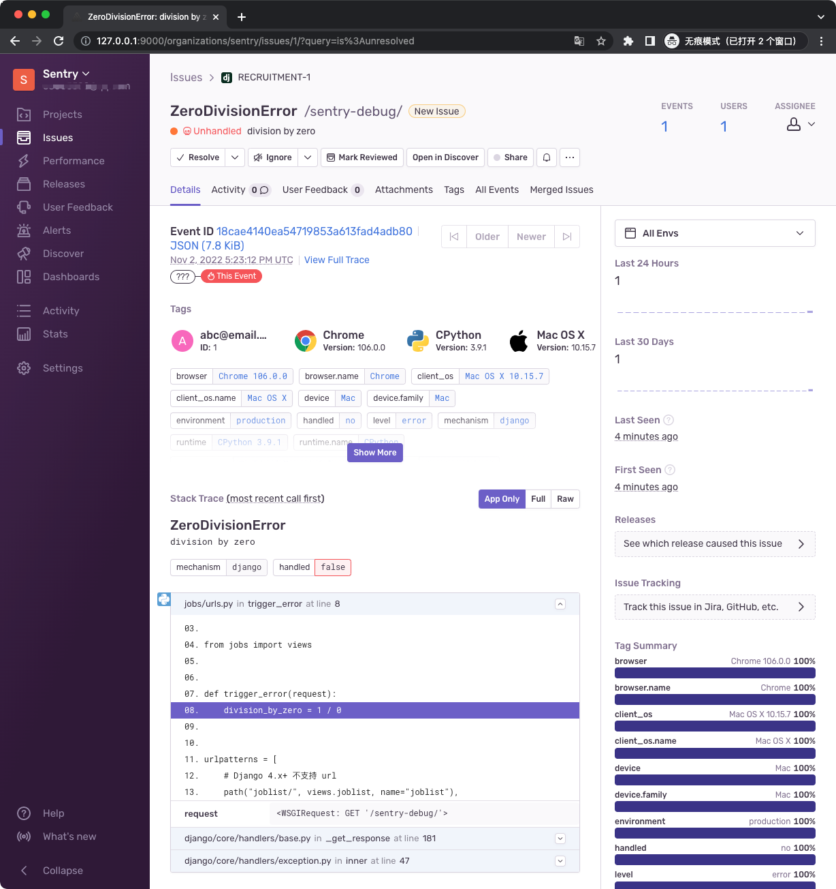
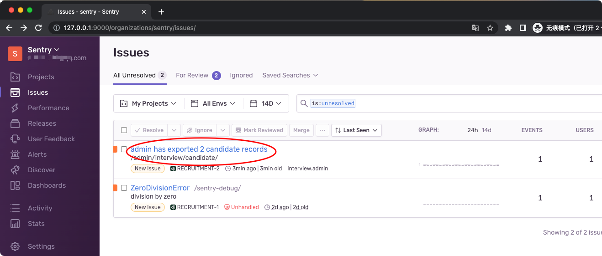
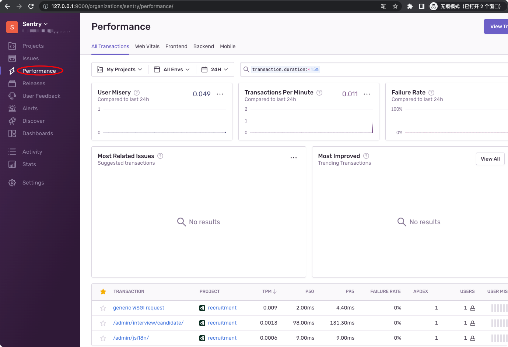

# Sentry 实时日志平台
> 准备 Docker 环境

## 安装 Sentry
```bash
$ wget https://github.com/getsentry/self-hosted/archive/refs/tags/22.10.0.zip
$ unzip 22.10.0.zip
$ cd self-hosted-22.10.0
# 按提示输入邮箱、密码
$ ./install.sh

# 启动
$ docker-compose up -d
$ docker ps |grep sentry
1a26da236f87   nginx:1.22.0-alpine                      "/docker-entrypoint.…"   7 seconds ago        Up 6 seconds                  0.0.0.0:9000->80/tcp           sentry-self-hosted_nginx_1
9309f51dc33e   getsentry/relay:22.10.0                  "/bin/bash /docker-e…"   7 seconds ago        Up 6 seconds                  3000/tcp                       sentry-self-hosted_relay_1
888d96d71f3a   sentry-cleanup-self-hosted-local         "/entrypoint.sh '0 0…"   39 seconds ago       Up 37 seconds                 9000/tcp                       sentry-self-hosted_sentry-cleanup_1
c295ff46e7f6   sentry-self-hosted-local                 "/etc/sentry/entrypo…"   39 seconds ago       Up 38 seconds (healthy)       9000/tcp                       sentry-self-hosted_web_1
982a3c6f15ff   sentry-self-hosted-local                 "/etc/sentry/entrypo…"   39 seconds ago       Up 38 seconds                 9000/tcp                       sentry-self-hosted_subscription-consumer-events_1
6da7fdc501e1   sentry-self-hosted-local                 "/etc/sentry/entrypo…"   39 seconds ago       Up 37 seconds                 9000/tcp                       sentry-self-hosted_worker_1
464ce25bc351   sentry-self-hosted-local                 "/etc/sentry/entrypo…"   39 seconds ago       Up 38 seconds                 9000/tcp                       sentry-self-hosted_post-process-forwarder-transactions_1
b35ab50bb324   sentry-self-hosted-local                 "/etc/sentry/entrypo…"   39 seconds ago       Up 37 seconds                 9000/tcp                       sentry-self-hosted_subscription-consumer-transactions_1
c2082ec34310   sentry-self-hosted-local                 "/etc/sentry/entrypo…"   40 seconds ago       Up 38 seconds                 9000/tcp                       sentry-self-hosted_cron_1
cd7c3819e673   sentry-self-hosted-local                 "/etc/sentry/entrypo…"   40 seconds ago       Up 38 seconds                 9000/tcp                       sentry-self-hosted_post-process-forwarder-errors_1
3daf72efe058   sentry-self-hosted-local                 "/etc/sentry/entrypo…"   40 seconds ago       Up 38 seconds                 9000/tcp                       sentry-self-hosted_ingest-consumer_1
9a832bcbea99   snuba-cleanup-self-hosted-local          "/entrypoint.sh '*/5…"   42 seconds ago       Up 40 seconds                 1218/tcp                       sentry-self-hosted_snuba-cleanup_1
263b027086e5   getsentry/snuba:22.10.0                  "./docker_entrypoint…"   42 seconds ago       Up 40 seconds                 1218/tcp                       sentry-self-hosted_snuba-consumer_1
13c392552c16   getsentry/snuba:22.10.0                  "./docker_entrypoint…"   42 seconds ago       Up 40 seconds                 1218/tcp                       sentry-self-hosted_snuba-outcomes-consumer_1
1b94ae36b58e   getsentry/snuba:22.10.0                  "./docker_entrypoint…"   42 seconds ago       Up 40 seconds                 1218/tcp                       sentry-self-hosted_snuba-replacer_1
2dec90518cc3   getsentry/snuba:22.10.0                  "./docker_entrypoint…"   42 seconds ago       Up 40 seconds                 1218/tcp                       sentry-self-hosted_snuba-api_1
f94fd75abcfa   getsentry/snuba:22.10.0                  "./docker_entrypoint…"   42 seconds ago       Up 40 seconds                 1218/tcp                       sentry-self-hosted_snuba-transactions-consumer_1
a42c7ee0872b   getsentry/snuba:22.10.0                  "./docker_entrypoint…"   42 seconds ago       Up 41 seconds                 1218/tcp                       sentry-self-hosted_snuba-subscription-consumer-transactions_1
883bfd1fb600   getsentry/snuba:22.10.0                  "./docker_entrypoint…"   42 seconds ago       Up 41 seconds                 1218/tcp                       sentry-self-hosted_snuba-subscription-consumer-events_1
240421c0f110   snuba-cleanup-self-hosted-local          "/entrypoint.sh '*/5…"   42 seconds ago       Up 41 seconds                 1218/tcp                       sentry-self-hosted_snuba-transactions-cleanup_1
9efd63c2d105   getsentry/snuba:22.10.0                  "./docker_entrypoint…"   42 seconds ago       Up 41 seconds                 1218/tcp                       sentry-self-hosted_snuba-sessions-consumer_1
4b58f82ff064   confluentinc/cp-kafka:5.5.0              "/etc/confluent/dock…"   About a minute ago   Up About a minute (healthy)   9092/tcp                       sentry-self-hosted_kafka_1
ee47b6b63c22   clickhouse-self-hosted-local             "/entrypoint.sh"         About a minute ago   Up About a minute (healthy)   8123/tcp, 9000/tcp, 9009/tcp   sentry-self-hosted_clickhouse_1
2e48700bf1e4   getsentry/symbolicator:0.5.1             "/bin/bash /docker-e…"   About a minute ago   Up About a minute             3021/tcp                       sentry-self-hosted_symbolicator_1
4ba334a7f047   postgres:9.6                             "/opt/sentry/postgre…"   About a minute ago   Up About a minute (healthy)   5432/tcp                       sentry-self-hosted_postgres_1
661a37232e7d   confluentinc/cp-zookeeper:5.5.0          "/etc/confluent/dock…"   About a minute ago   Up About a minute (healthy)   2181/tcp, 2888/tcp, 3888/tcp   sentry-self-hosted_zookeeper_1
dbc283d99b4e   tianon/exim4                             "docker-entrypoint.s…"   About a minute ago   Up About a minute             25/tcp                         sentry-self-hosted_smtp_1
1c7d553fb396   memcached:1.6.9-alpine                   "docker-entrypoint.s…"   About a minute ago   Up About a minute (healthy)   11211/tcp                      sentry-self-hosted_memcached_1
86b6513450df   redis:6.2.4-alpine                       "docker-entrypoint.s…"   About a minute ago   Up About a minute (healthy)   6379/tcp                       sentry-self-hosted_redis_1
563e1961198c   symbolicator-cleanup-self-hosted-local   "/entrypoint.sh '55 …"   About a minute ago   Up About a minute             3021/tcp                       sentry-self-hosted_symbolicator-cleanup_1
```

## 配置 Sentry
> `http://127.0.0.1:9000/`  


### 创建 Team
Settings -> Teams -> Create Team


### 创建 Project
Settings -> Projects -> Create Project -> Choose a platform


### 查看配置代码


## 配置 Django
### 安装 sentry-sdk
```bash
# 在项目 Python 环境下
$ pip install --upgrade sentry-sdk
```

### 配置 settings
```bash
$ cat settings/local.py

...

import sentry_sdk
from sentry_sdk.integrations.django import DjangoIntegration

sentry_sdk.init(
    dsn="http://ebc94be7ebd548d2bcbcf86bc3b2300e@127.0.0.1:9000/2",
    integrations=[
        DjangoIntegration(),
    ],

    # Set traces_sample_rate to 1.0 to capture 100%
    # of transactions for performance monitoring.
    # We recommend adjusting this value in production.
    # 采样率，1.0 即百分百采样，生产环境访问量过大时，建议调小（不用每个 URL 请求都记录性能）
    traces_sample_rate=1.0,

    # If you wish to associate users to errors (assuming you are using
    # django.contrib.auth) you may enable sending PII data.
    send_default_pii=True
)
```

### 配置 URL
[jobs/urls.py](../jobs/urls.py)

## 测试
### 访问 sentry-debug
> `http://127.0.0.1:8000/sentry-debug/`  



## 查看 Sentry 后台
### 查看 Issues



## 记录错误日志
### 模拟导出 csv 时记录日志
[interview/admin.py](../interview/admin.py)

### 导出 2 条应聘者后，查看日志



