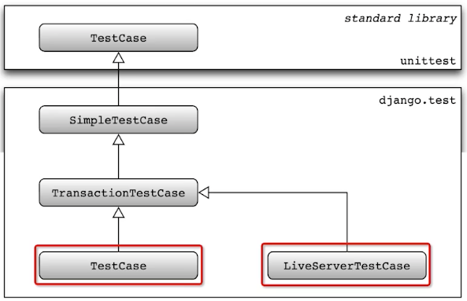
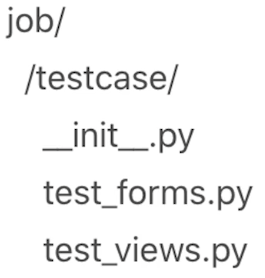

# 单元测试
## 测试用例基类层次

- SimplTestCase
  - 可以发起 HTTP 请求，跟页面、模板、URL 交互，禁止了数据库的访问。
- TransactionTestCase
  - 在用例运行之后，清理所有表来重置数据库；
  - 可运行提交、回滚来观察中间状态（需要测试事务时使用）。
- TestCase
  - 测试用例执行完后不清理表数据；
  - 在一个事务中执行用例，最后自动回滚事务。
- LiveServerTestCase
  - 在后台自动启动一个 Server，以便使用外部工具如 Selenium 做测试。

## 目录结构组织
### 哪些逻辑需要测试？
Django 自带的代码（框架中实现的）逻辑不需要测试，自己写的代码需测试，如自定义页面的访问，自定义的功能菜单。

### 测试用例目录
`Django` 使用 `unittest` 模块的内置测试查找机制，它将在当前工作目录下，查找任何匹配模式 `test*.py` 命名的文件作为 `Test Case`。  


## 执行测试用例
```shell
# 运行项目下所有 test
$ python manage.py test

# 测试指定模块
$ python manage.py test jobs.testcase

# 测试单个模块中的文件
$ python manage.py test jobs.testcase.test_views

# 指定类
$ python manage.py test jobs.testcase.test_views.JobTests

# 测试指定方法
$ python manage.py test jobs.testcase.testviews.JobTests.test_detail
```

## 编写测试用例
`testcase` 下必须要有 `__init__.py` 文件。  
[jobs/testcase/test_views.py](../jobs/testcase/test_views.py)

## 运行单元测试
```shell
$ python manage.py test
2022-11-13 20:25:55,127 jobs.apps    13 INFO     JobConfig ready
Found 3 test(s).
Creating test database for alias 'default'...
System check identified no issues (0 silenced).
/recruitment/venv/lib/python3.9/site-packages/django/db/models/fields/__init__.py:1409: RuntimeWarning: DateTimeField Job.created_date received a naive datetime (2022-11-13 20:25:55.931538) while time zone support is active.
  warnings.warn("DateTimeField %s received a naive datetime (%s)"
/recruitment/venv/lib/python3.9/site-packages/django/db/models/fields/__init__.py:1409: RuntimeWarning: DateTimeField Job.modified_date received a naive datetime (2022-11-13 20:25:55.931544) while time zone support is active.
  warnings.warn("DateTimeField %s received a naive datetime (%s)"
.2022-11-13 20:25:55,937 jobs.views   42 INFO     job info fetched from database jobid:1
2022-11-13 20:25:55,957 interview.performance 36 INFO     duration:0.0241851806640625 url:/job/1/ parameters:{}
.2022-11-13 20:25:55,963 interview.performance 36 INFO     duration:0.004769802093505859 url:/joblist/ parameters:{}
.
----------------------------------------------------------------------
Ran 3 tests in 0.033s

OK
Destroying test database for alias 'default'...

# 修改 joblist URL 为不存的 URL
$ cat jobs/testcase/test_views.py
    def test_index(self):
        client = Client()
        response = client.get('/joblist/aaa')
        self.assertEqual(response.status_code, 200)

# 运行测试用例
$ python manage.py test
2022-11-13 20:27:23,638 jobs.apps    13 INFO     JobConfig readytest
Found 3 test(s).
Creating test database for alias 'default'...
System check identified no issues (0 silenced).
/recruitment/venv/lib/python3.9/site-packages/django/db/models/fields/__init__.py:1409: RuntimeWarning: DateTimeField Job.created_date received a naive datetime (2022-11-13 20:27:24.406196) while time zone support is active.
  warnings.warn("DateTimeField %s received a naive datetime (%s)"
/recruitment/venv/lib/python3.9/site-packages/django/db/models/fields/__init__.py:1409: RuntimeWarning: DateTimeField Job.modified_date received a naive datetime (2022-11-13 20:27:24.406201) while time zone support is active.
  warnings.warn("DateTimeField %s received a naive datetime (%s)"
.2022-11-13 20:27:24,411 jobs.views   42 INFO     job info fetched from database jobid:1
2022-11-13 20:27:24,428 interview.performance 36 INFO     duration:0.01992201805114746 url:/job/1/ parameters:{}
.2022-11-13 20:27:24,430 interview.performance 36 INFO     duration:0.0010280609130859375 url:/joblist/aaa parameters:{}
2022-11-13 20:27:24,430 django.request 225 WARNING  Not Found: /joblist/aaa
F
======================================================================
FAIL: test_index (jobs.testcase.test_views.JobTests)
----------------------------------------------------------------------
Traceback (most recent call last):
  File "/recruitment/jobs/testcase/test_views.py", line 24, in test_index
    self.assertEqual(response.status_code, 200)
AssertionError: 404 != 200

----------------------------------------------------------------------
Ran 3 tests in 0.025s

FAILED (failures=1)
Destroying test database for alias 'default'...
```
