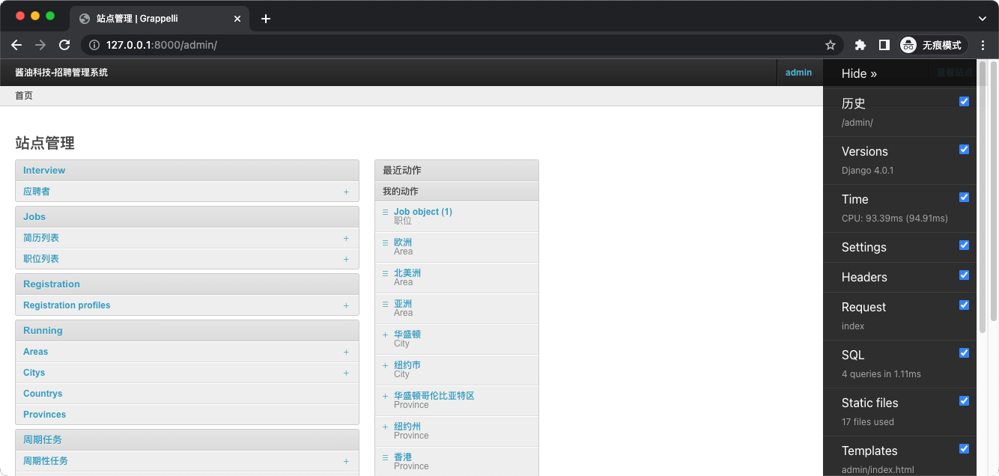
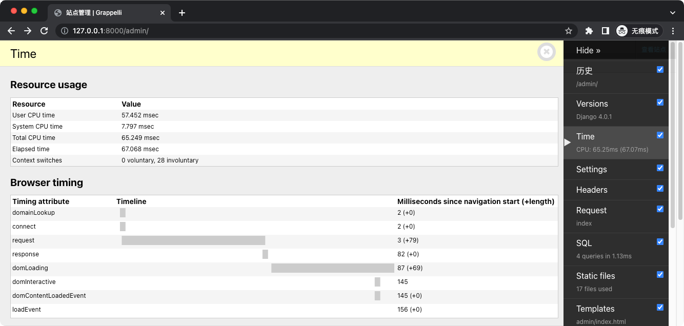
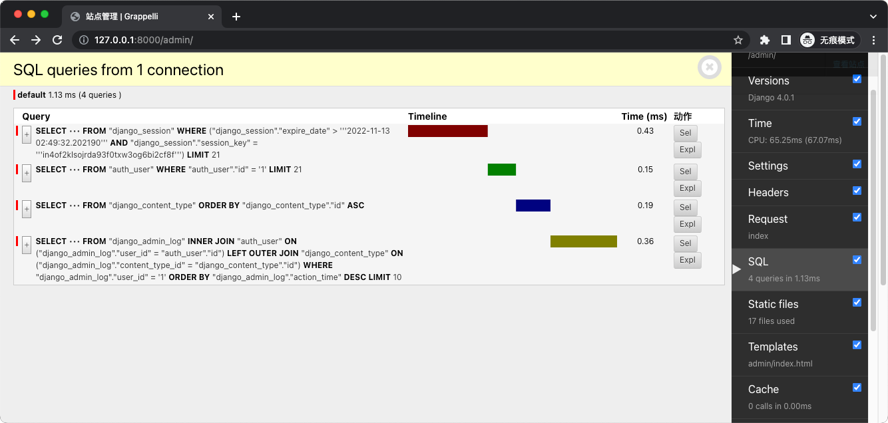
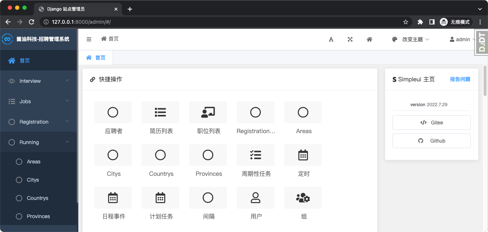
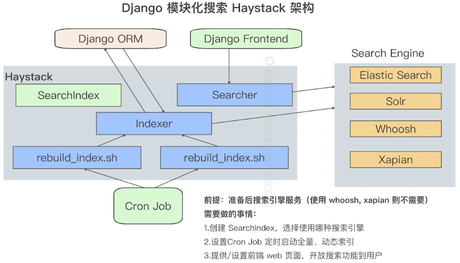

# The beauty of django
## Django 常用插件
### Django debug toolbar
可在开发环境开启，运行时显示 Debug 信息。
```shell
# 安装
$ pip install django_debug_toolbar

# 配置
$ cat settings/base.py
## Check for Prerequisites
INSTALLED_APPS = [
    # ...
    "django.contrib.staticfiles",
    # ...
]

STATIC_URL = "static/"

TEMPLATES = [
    {
        "BACKEND": "django.template.backends.django.DjangoTemplates",
        "APP_DIRS": True,
        # ...
    }
]

## Add the Middleware
MIDDLEWARE = [
    # ...
    "debug_toolbar.middleware.DebugToolbarMiddleware",
    # ...
]

$ cat settings/local.py
## Install the App
INSTALLED_APPS += (
    'debug_toolbar',
)

##  Configure Internal IPs
INTERNAL_IPS = [
    "127.0.0.1",
]

# Add the URLs
$ cat recruitment/urls.py
if settings.DEBUG:
    import debug_toolbar
    urlpatterns.append(path('__debug__/', include(debug_toolbar.urls)))
```




### Django simpleui
基于 Element UI 和 VUE 的 Django Admin 主题
```shell
$ pip install django-simpleui

# 安装APP
$ cat settings/base.py
INSTALLED_APPS = [
    # 主题需加在 admin 之前
    'simpleui',
    'grappelli',
    'bootstrap4',
    'registration',
    'django.contrib.admin',
# ...
]
```


### Haystack
Django 模块化搜索


### Django notifications
发送消息通知

### Django markdown editor
Markdown 编辑器

### Django crispy forms
Crispy 表单，以一种非常优雅、干净的方式来创建美观的表单

### Django simple captcha
Django 表单验证码
