# OpenLDAP 安装配置
## 安装
```bash
$ docker run -p 389:389 -p 636:636 --name openldap-container \
--env LDAP_ORGANISATION="wowking" \
--env LDAP_DOMAIN="wowking.cc" \
--env LDAP_ADMIN_PASSWORD="123456" \
--detach osixia/openldap:1.4.0

# Web 管理后台
$ docker run -p 80:80 -p 443:443 --name phpldapadmin-service \
--hostname phpldapadmin-service \
--link openldap-container:ldap-host \
--env PHPLDAPADMIN_LDAP_HOSTS=ldap-host \
--detach osixia/phpldapadmin:0.9.0
```

## 浏览器访问
`https://127.0.0.1`
> username:cn=admin,dc=wowking,dc=cc  
> password:123456  

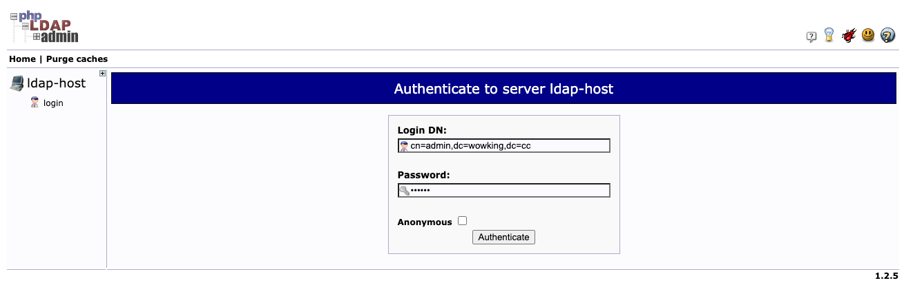

## 创建用户
### 创建GROUP
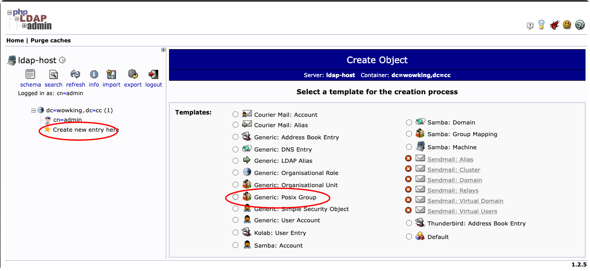
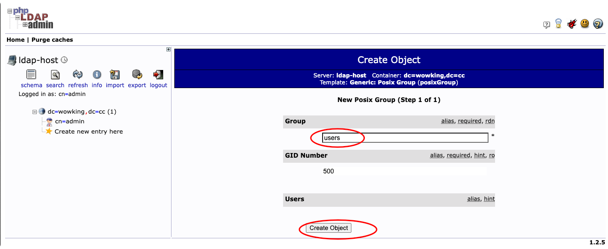
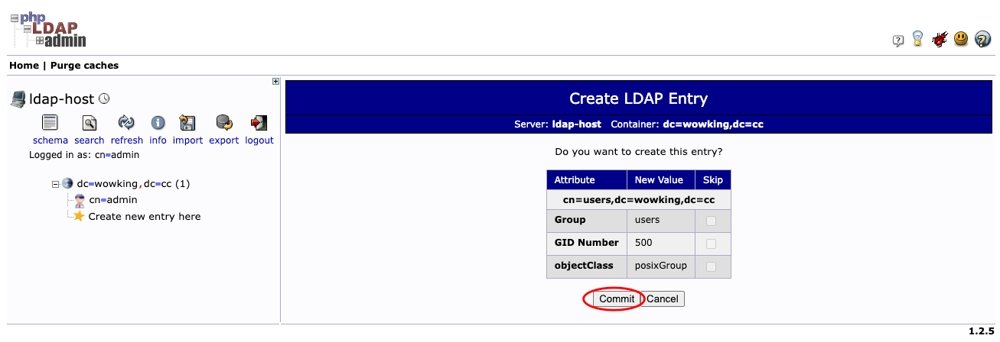

### 创建用户
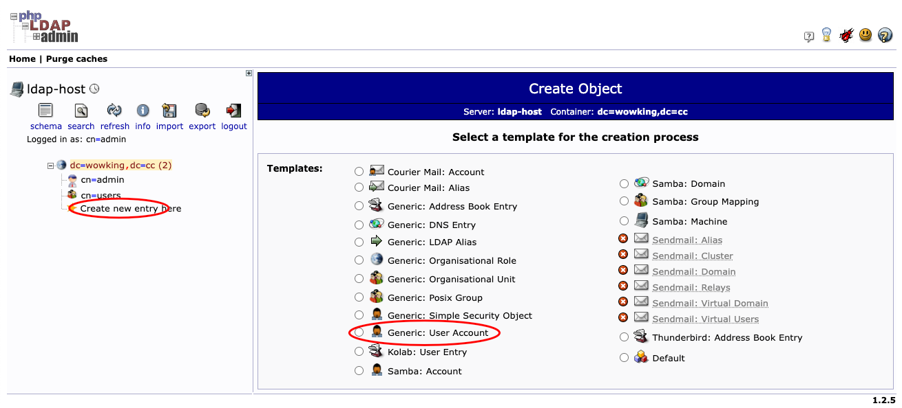
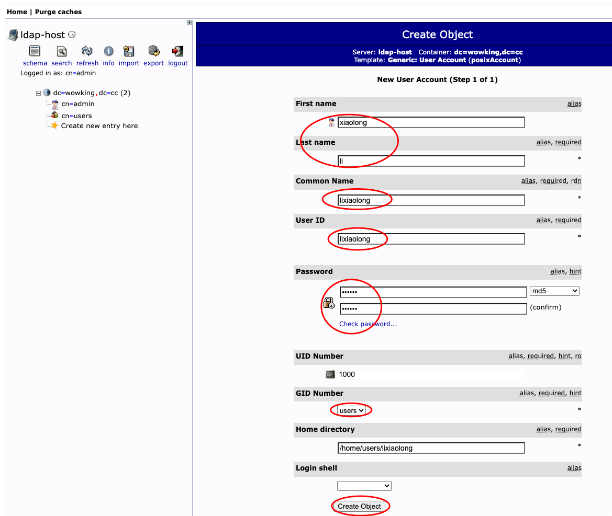
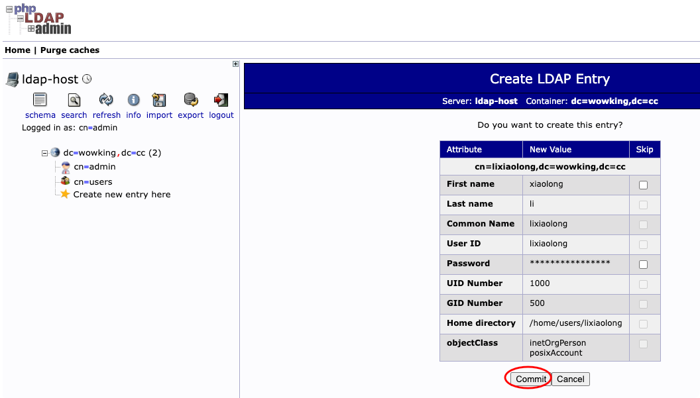

## 配置
### 安装与注册
```bash
# 安装 APP
$ pip3 install django-python3-ldap

# 注册 APP
$ vim recruitment/settings.py
INSTALLED_APPS = [
...
    'django_python3_ldap',
    'jobs',
    'interview',
]
```

## LDAP 配置
```bash
$ vim recruitment/settings.py
# LDAP
LDAP_AUTH_URL = "ldap://127.0.0.1:389"

# Initiate TLS on connection.
LDAP_AUTH_USE_TLS = False

LDAP_AUTH_SEARCH_BASE = "dc=wowking,dc=cc"

# 认证用户的类型，组织的人员
LDAP_AUTH_OBJECT_CLASS = "inetOrgPerson"

# Django用户字段与LDAP用户字段对应关系
LDAP_AUTH_USER_FIELDS = {
    "username": "cn",
    "first_name": "givenName",
    "last_name": "sn",
    "email": "mail",
}

# LDAP 登录的时候，如果 Django 里已经有相应的账号，则使用 username 作为 LDAP 的登录用户名
LDAP_AUTH_USER_LOOKUP_FIELDS = ("username",)
LDAP_AUTH_CLEAN_USER_DATA = "django_python3_ldap.utils.clean_user_data"

# LDAP 连接用户名与密码
LDAP_AUTH_CONNECTION_USERNAME = "admin"
LDAP_AUTH_CONNECTION_PASSWORD = "123456"

# 允许使用 LDAP 账号与 Django 账号 2 种方式登录
AUTHENTICATION_BACKENDS = {"django_python3_ldap.auth.LDAPBackend", "django.contrib.auth.backends.ModelBackend", }
```

## LDAP 登录
### 使用 LDAP 账号登录
因 LDAP 用户属性为非员工，登录会失败。
首次登录时 Django 会将 LDAP 账号同步到 Django 后台。
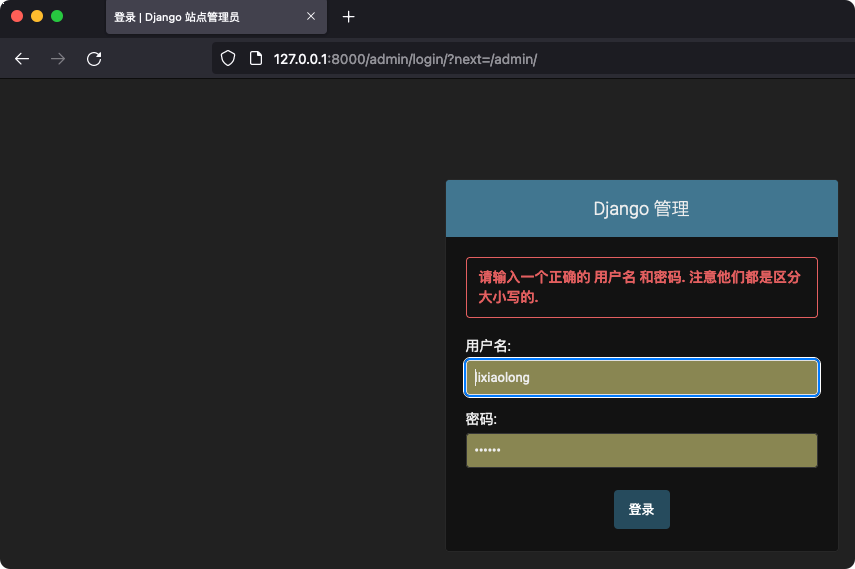

### 使用 Django 账号登录
可以看到 LDAP 账号已同步到 Django 后台。
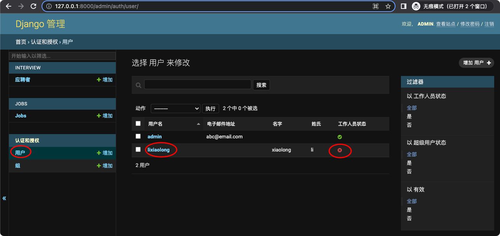

修改 LDAP 账号 `lixiaolong` 属性。 
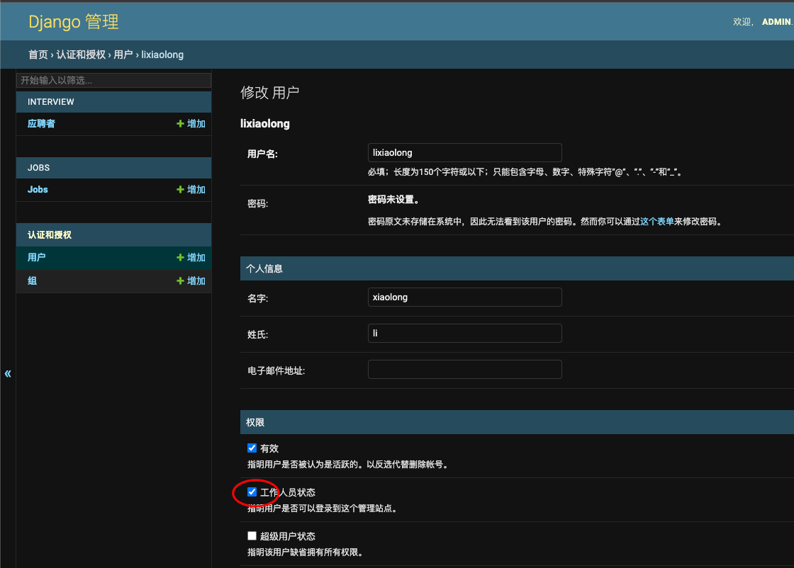

### 使用 LDAP 账号登录
重新登录
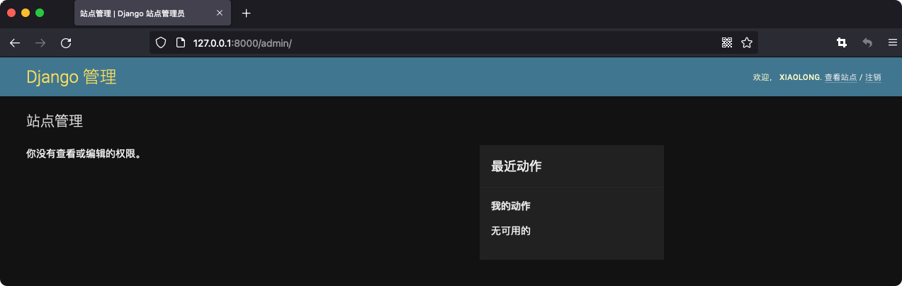

## 批量导入 LDAP 账号
```bash
$ python ./manage.py ldap_sync_users 
Synced lisi
Synced zhangsan
Synced lixiaolong
``
